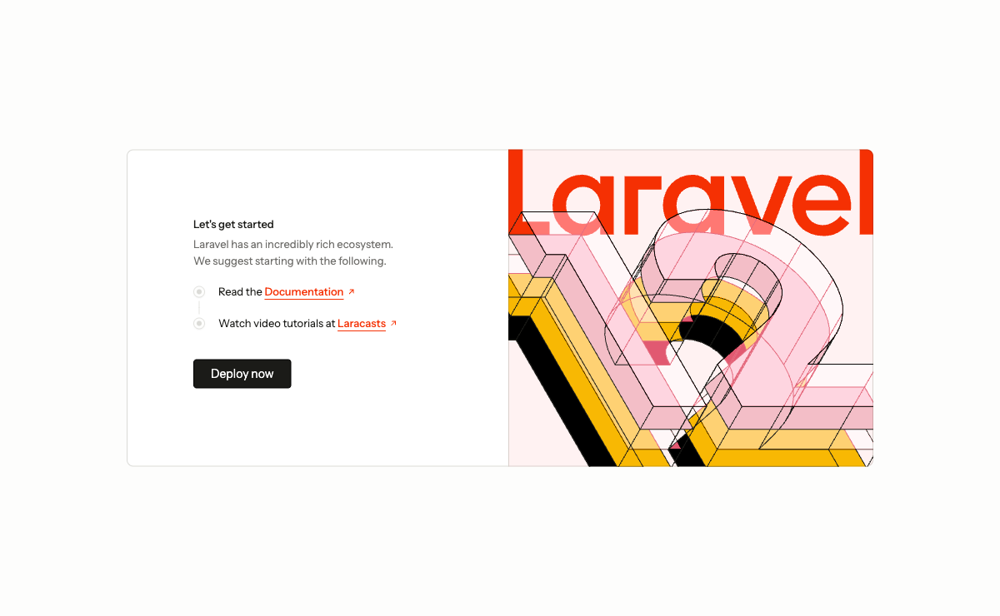

# 第 1 章　安装 Laravel 12

目标：在 `engine/` 子目录里创建一个 Laravel 12 应用，连接本机 MariaDB 数据库
`moo_skeleton`，并在真实浏览器里打开它的欢迎页。

> **先分清你走哪条路。** 仓库根 [README](../README.md) 定义了两种用法：
> **方式 A = 直接用本仓库**（克隆下来，`engine/` 已是最终成品）；
> **方式 B = 从 0 跟教程一步步搭**。本章及后续教程面向**方式 B**。
> 如果你是克隆仓库的方式 A 读者：根目录已经存在 `engine/`，1.2 的
> `composer create-project` 会因目录非空直接报错；而且 `engine/.env.example`
> 已预填好 1.4 的全部配置，只需 `cp .env.example .env && php artisan key:generate`，
> 1.2–1.4 可整体跳过——请直接按根 README 的「快速开始（方式 A）」操作。

---

## 1.1 准备环境

还没有项目目录的话先建一个——它就是后文一直说的「仓库根目录」：

```bash
mkdir moo-engine-skeleton && cd moo-engine-skeleton    # git init 可选
```

本教程在 macOS 上用 [Homebrew](https://brew.sh) 安装基础工具（已装好的请跳过）：

```bash
brew install php composer node mariadb
brew services start mariadb        # 启动 MariaDB，监听 127.0.0.1:3306
```

> **MariaDB 新装后必做**：Homebrew 新装的 MariaDB 默认 root 账号走 unix socket 认证
> （通过操作系统用户身份免密登录），Laravel 连接走 TCP（127.0.0.1:3306）必须用账号+密码。
> 先给 root 设一个密码（教程示例用 `7777`）：
>
> ```bash
> sudo mysql -uroot -e "ALTER USER 'root'@'localhost' IDENTIFIED BY '7777'; FLUSH PRIVILEGES;"
> ```
>
> **立即验证**密码是否生效（如果这一步失败，后续 1.3 建库会卡死）：
>
> ```bash
> mysql -uroot -p7777 -h127.0.0.1 -e "SELECT VERSION();"
> # 期望输出：包含 mariadb.org binary distribution 字样 + 版本号（如 12.x.x-MariaDB）
> ```
>
> **如果验证失败**，按以下步骤排查：
> 1. 重试密码设置命令（可能未生效）
> 2. 确认 `localhost` vs `127.0.0.1` 的区别：`ALTER USER 'root'@'localhost'` 只对 localhost 生效，
>    连 `127.0.0.1` 需要 `ALTER USER 'root'@'127.0.0.1'` 或 `'root'@'%'`
> 3. 如果仍然失败，检查 MariaDB 错误日志：`brew services log mariadb`

然后确认本机工具齐全（在仓库根目录执行）：

```bash
php -v            # 8.2 起即可，本教程用 8.3.31（8.2 / 8.3 的区别见下方说明）
composer --version
mysql --version   # MariaDB 12.x 客户端
```

> **PHP 到底要 8.2 还是 8.3？** 从 0 跟教程搭（方式 B）时，`laravel/laravel`
> 只要求 PHP `^8.2`，用 8.2 完全可行；**直接用本仓库（方式 A）才必须 8.3**——
> 仓库 `engine/composer.lock` 是按 8.3 解析的（其中 `php-open-source-saver/jwt-auth`
> 2.9 要求 PHP `^8.3`），在 8.2 上 `composer install` 装不上。

> `root / 7777` 是**本教程的示例凭据**——换成你自己的数据库账号密码即可，
> 后续所有命令里的 `-p7777` 同步替换。

**如果你是从方式 A 转到方式 B**（克隆了仓库又想从头跟教程）：根目录已有 `engine/`，
请先 `mv engine engine.backup` 或删除，否则 1.2 的 `composer create-project` 会因目录非空报错。

## 1.2 创建 Laravel 12 项目到 engine/

本教程直接用 `composer create-project`（不需要全局安装 laravel/installer），并指定目录为 `engine`：

```bash
# 在仓库根目录 moo-engine-skeleton/ 下执行
composer create-project "laravel/laravel:^12.0" engine --no-interaction
```

装完后实测版本：

```bash
cd engine
php artisan --version
# Laravel Framework 12.61.1   ← 小版本号以实际安装为准（^12.0 内都没问题）
```

## 1.3 创建数据库

```bash
mysql -uroot -p7777 -h127.0.0.1 -e \
  "CREATE DATABASE IF NOT EXISTS moo_skeleton CHARACTER SET utf8mb4 COLLATE utf8mb4_unicode_ci;"
```

## 1.4 配置 .env 连接数据库（取消注释，不要追加）

`create-project` 已经自动生成了 `engine/.env`（`APP_KEY` 也已自动填好，不用再
`key:generate`），但它默认用 SQLite，要改成连本机数据库。注意一个容易疑惑的点：
**本机装的是 MariaDB，但 `DB_CONNECTION` 写的是 `mysql`**——MariaDB 与 MySQL
协议完全兼容，用 `mysql` 驱动连 MariaDB 是惯例写法（本机若装的是 MySQL 8 则更不用改）。
编辑 `engine/.env`，改成下面这样：

```dotenv
APP_NAME=moo-engine-skeleton
APP_URL=http://127.0.0.1:8088

DB_CONNECTION=mysql
DB_HOST=127.0.0.1
DB_PORT=3306
DB_DATABASE=moo_skeleton
DB_USERNAME=root
DB_PASSWORD=7777
```

> **别在文件末尾追加！** 默认 `.env` 里 `DB_CONNECTION=sqlite`，而
> `DB_HOST` / `DB_PORT` / `DB_DATABASE` / `DB_USERNAME` / `DB_PASSWORD` 这几行
> 是被 `#` 注释掉的——请找到这几行，**取消注释并改成上面的值**。
> 若只在末尾追加新值，文件里会同时留着注释掉的旧行，日后排查容易看花眼。

> 端口为什么是 8088？最初只是因为作者本机 8000 端口被其它项目占用（见 1.6），
> 但 8088 现在已是**本仓库的约定端口**——`engine/.env`、根 README、第 2 章起的
> 所有命令都用它。建议跟教程统一用 8088；也可以自选空闲端口，但 `APP_URL`
> 以及后续章节所有 curl / 调试器地址都要同步修改、全程保持一致。

改完清掉配置缓存：

```bash
php artisan config:clear
```

## 1.5 执行数据库迁移

把 Laravel 自带的基础表建到 `moo_skeleton` 里（在 `engine/` 目录下执行）：

```bash
php artisan migrate
```

> 你可能在别处见过 `php artisan migrate:fresh --force`：`fresh` 会**先删掉库里
> 全部表**再重新迁移——在全新空库上和 `migrate` 等效，但日后在有数据的库上
> 执行会把数据清光；`--force` 则是让命令在生产环境跳过「确认执行」的交互提示。
> 日常按本教程用 `migrate` 即可。

验证表已建好：

```bash
mysql -uroot -p7777 -h127.0.0.1 moo_skeleton -e "SHOW TABLES;"
```

应能看到 **9 张表**（按字母序）：`cache`、`cache_locks`、`failed_jobs`、`job_batches`、
`jobs`、`migrations`、`password_reset_tokens`、`sessions`、`users`。

## 1.6 启动并真机访问

启动开发服务器（端口与 1.4 的 `APP_URL` 保持一致，教程统一用 8088）：

```bash
php artisan serve --host=127.0.0.1 --port=8088
```

> 端口被占时如何排查（比如想确认 8000 被谁占用）：
> ```bash
> lsof -nP -iTCP:8000 -sTCP:LISTEN     # 看谁在用 8000
> ```

> **注意**：`php artisan serve` 是前台进程，会一直占着当前终端（`Ctrl+C` 停止）。
> 浏览器访问不受影响，但下面的命令行自检需要**另开一个终端窗口**再执行。

用浏览器打开 `http://127.0.0.1:8088`，能看到 Laravel 12 的欢迎页即成功：



命令行快速自检（新终端里执行）：

```bash
curl -s -o /dev/null -w "%{http_code}\n" http://127.0.0.1:8088   # 期望 200
```

## 1.7 接入 moo-monitor-laravel（监控先行 · 标准件必装）

**监控与 JWT/限流/操作日志同级，是本骨架约定的强制标准件——接入本身＝必选，不是可选项。**
（`engine/composer.json` 把它作为硬 `require`，缺它 `composer install` 直接失败。）
**只有**后面 §1.7.5 的「**推送到云端**」才是可选——本地落盘到 `storage/moo-monitor/`
不依赖任何云端 token，没 token 照样完整可用。
本节在裸 Laravel 上接入 `charsen/moo-monitor-laravel` 包，配置好后，后端运行时异常和慢 SQL
会自动记录到 `storage/moo-monitor/`，并可推送到 moo-scaffold-cloud 云端集中查看。
新手最怕「不知道哪儿出错了、在哪看、连日志文件在哪都不知道」——监控先行，
后续章节的所有报错都有了「去哪看」的答案。

> **新手最常担心的两件事，这个包都替你兜住了：**
> - **失败隔离**：监控是**旁路采集**，写盘失败、云端不通等任何环节出错都被 `SafelyLogs`
>   静默吞掉，**绝不拖垮、也不拖慢你的业务请求**——装它只多一层保险，不引入新风险。
> - **自动脱敏**：异常 / 慢 SQL 落盘**之前**，URL query、payload 键名、SQL 列名里命中
>   `password / pwd / token / secret / api_key / authorization`（子串、不分大小写）的值会被抹成 `***`，
>   所以连本地 `storage/moo-monitor/` 的 yaml 都不含明文密钥。自定义敏感字段见 [第 10 章 §10.6.4](./10-云端监控进阶.md)。

### 1.7.1 安装 moo-monitor-laravel

这个包的定位：**headless 采集 SDK**（不提供本地页面，采集 + 缓冲 + 推送云端），
MIT 协议，目标发布到 Packagist。但目前尚未公开发布，接入方式与第 2 章的
`moo-scaffold` 类似——开发用 path 仓库、生产用 vcs。

**前置条件**：包源码已克隆在与本仓库**同级**的目录（`../../moo-monitor-laravel`）。
拿不到源码的读者，本节只能「读通」、跑不起来——包发布后一行
`composer require charsen/moo-monitor-laravel` 即可。

编辑 `engine/composer.json`，在 `"require"` 块里追加（不是整段替换）：

```json
"require": {
    "charsen/moo-monitor-laravel": "dev-master as 0.1.99"
}
```

在 `"repositories"` 块里追加（如果还没有这个块，就新建）：

```json
"repositories": {
    "monitor": { "type": "path", "url": "../../moo-monitor-laravel" }
}
```

> **包发布后**（正式上 Packagist），直接 `composer require charsen/moo-monitor-laravel`，
> 不需要声明 repositories。生产环境的 vcs 接入参考第 2 章对 scaffold 的说明。

安装：

```bash
composer update charsen/moo-monitor-laravel --with-all-dependencies
```

验证命令已注册：

```bash
php artisan list | grep "moo:cloud"
# 应能看到 moo:cloud:push / moo:cloud:test / moo:cloud:mcp
```

### 1.7.2 配置 .env

编辑 `engine/.env`，在文件末尾追加：

```dotenv
# ──────────────────────────────────────────────────────────────────────
# 监控（moo-monitor-laravel，第 1.7 节接入）
MOO_MONITOR_SQL_SLOW_ENABLED=true
MOO_MONITOR_SQL_SLOW_THRESHOLD_MS=100
MOO_MONITOR_CLOUD_ENABLED=true
MOO_MONITOR_CLOUD_TOKEN=moo_xxxxxxxxxxxxxxxxxxxxxxxxxxxxxxxxxxxxxxxx
```

> `MOO_MONITOR_CLOUD_TOKEN` 需要在 moo-scaffold-cloud（`https://sc.mooeen.com`）
> 注册项目后获得。免费档支持 ≤3 个项目，注册流程：登录 → 新建项目 →
> 复制接入 token。**没有 token 也不影响本地采集**——下面故意触发的异常仍然会落盘
> `storage/moo-monitor/`，只是暂时推不到云端；拿到 token 后补配即可。
>
> **方式 A 读者注意**：成品 `engine/.env.example` 默认只含 `MOO_MONITOR_SQL_SLOW_*` 两行，
> **不含**上面的 `MOO_MONITOR_CLOUD_ENABLED` / `MOO_MONITOR_CLOUD_TOKEN`——这是有意的：
> `config/moo-monitor.php` 里 `cloud.enabled` 默认 `false`，不配也能本地落盘。你在
> `.env.example` 里找不到这两项不是漏配，按需自己加即可。

清理配置缓存：

```bash
php artisan config:clear
```

### 1.7.3 自动挂钩：零代码上报

**MonitorProvider 自动注册 reportable 钩子**，宿主项目不需要写任何异常采集代码。
`engine/bootstrap/app.php` 已经有注释说明这一点（第 47-48 行）：

```php
// 运行时异常采集:scaffold 3.9.0 起由 moo-monitor-laravel 的 MonitorProvider
// 自动挂 reportable 钩子,无需手动接入(落盘 storage/moo-monitor/runtimes,推送上云后在云端查看)。
```

这是 **moo-monitor-laravel 的核心便利性**——装包 + 配 `.env` 即生效，
无需改任何业务代码。

### 1.7.4 验证：故意触发异常

启动开发服务器（需要 4 个 worker + `--no-reload`，这是本仓库的约定启动方式，
原因见第 2 章）：

```bash
PHP_CLI_SERVER_WORKERS=4 php artisan serve --host=127.0.0.1 --port=8088 --no-reload
```

用 curl 访问一个不存在的路由（会触发 404，但 404 在 `bootstrap/app.php` 的
`dontReport` 列表里，不会被记录）。我们需要一个**真实的 HTTP 5xx 异常**。

> **为什么不能用 `php artisan tinker` 或 `php -r` 手动抛？** 这两条路径都验证不了落盘：
> tinker（Psy Shell）的 REPL 自己 catch 未捕获的 throw 并渲染，根本不经过 Laravel
> 异常处理器的 `report()`，而监控正是挂在 `report()` → `reportable` 链上的；退一步说，
> 即便走到分发，`config/moo-monitor.php` 的 `exception.cli_experiment_skip`（默认 `true`）
> 会专门过滤掉 tinker / `php -r` 里经 `eval` 执行、异常文件名为 `Command line code` 的
> 「实验异常」——这是包作者刻意设计的。所以必须用**真实的 HTTP 请求**触发。
>
> 同理，`exception.console_input_skip`（默认 `true`）会跳过 artisan 命令打错、参数缺失这类
> **Console 用法错**——那是你敲错命令、不是应用 bug，没必要污染异常档案。

最简单的方法：在 `routes/web.php` 里**临时**加一条会抛异常的路由（验证完即删）：

```php
// routes/web.php —— 临时验证用，验证完务必删掉这一行
Route::get('/__boom', fn () => throw new \RuntimeException('测试监控：故意抛出的异常'));
```

**新开一个终端窗口**，用 curl 访问它（会得到 HTTP 500）：

```bash
curl -s -o /dev/null -w "%{http_code}\n" http://127.0.0.1:8088/__boom   # 期望 500
```

这条异常源自 `routes/web.php`（不是 `Command line code`），且走完整的 `report()` →
`reportable` 链，不会被 `cli_experiment_skip` 过滤，因此会落盘。查看本地缓冲：

```bash
ls storage/moo-monitor/runtimes/open/
# 应能看到一个以 hash 命名的 .yaml 文件，如 5780e6fc7913.yaml
```

查看文件头部（前 20 行）：

```bash
head -20 storage/moo-monitor/runtimes/open/*.yaml
```

输出示例：

```yaml
hash: 5780e6fc7913
first_seen: '2026-06-12T15:09:00.480+00:00'
last_seen: '2026-06-12T15:09:00.480+00:00'
count: 1
status: open
exception:
  class: RuntimeException
  message: '测试监控：故意抛出的异常'
  file: ...
  line: ...
request:
  method: GET
  url: 'http://127.0.0.1:8088/__boom'
  ip: 127.0.0.1
context:
  env: local
  project: moo-engine-skeleton
```

> **验证完务必删掉临时路由**：回到 `routes/web.php`，删掉上面那条 `/__boom` 路由
> （它只是用来制造一次真实异常的，绝不能留在代码里）。

**从此报错有地方看了。** 即使还没接入云端，本地 `storage/moo-monitor/runtimes/`
就是你的异常档案馆——后续章节任何时候报错，先来这里看 `open/` 目录下最新的文件，
里面有完整的异常类型、消息、文件行号、调用栈和源码片段。

### 1.7.5 推送到云端（可选）

如果你已经拿到 cloud token 并配到 `.env`，先一键自检整条管道，确认无误后再推真实数据上云。

**先自检**——不用等真异常发生，`moo:cloud:test` 直接推一条自检 runtime + 一条自检慢 SQL
走真实接口，把「配置 → 连通 → 鉴权 → 推送」四步逐个走一遍并分别反馈，哪一步断一目了然：

```bash
php artisan moo:cloud:test             # 完整自检（runtime + 慢 SQL）
# 只测一类：--type=runtimes / --type=slow_sql
# 加 --resolve：推送后在云端把自检 runtime 自动标记已解决（默认保留「未处理」，便于亲眼确认数据已到达）
```

输出示例（token 会自动打码，不落终端 / CI 日志）：

```
moo-monitor 云端连通性自检
────────────────────────────────────────────────
① 配置检查
   云端地址  : https://sc.mooeen.com
   接入 token : moo_************xxxx
   采集开关  : 已开启
② 连通与鉴权(心跳)
   ✓ 心跳正常:云端可达、token 有效。
③ 推送一条自检 runtime
   ✓ 已推送(saved=1, hash=……)。
④ 推送一条自检慢 SQL
   ✓ 已推送(saved=1, hash=……)。
────────────────────────────────────────────────
✓ 自检通过:接入配置有效,推送管道通畅。
```

> 没配 / token 错 / 网络不通时，它会在对应步骤明确报错并给排查项（如「✗ 心跳失败 ——
> 无法连通云端，或 token 无效」），比 `moo:cloud:push` 推完一片沉默好定位得多。自检记录
> 落在云端「未处理」，去 runtimes 列表即可亲眼确认数据已到达。

**自检通过后**，再把刚才真实采集的异常推上云：

```bash
php artisan moo:cloud:push --dry-run   # 预演，只统计待推送数量
php artisan moo:cloud:push             # 真实推送
```

输出示例：

```
+----------+------+------+------+------------------+
| 类型     | 扫描 | 变更 | 推送 | 结果             |
+----------+------+------+------+------------------+
| runtimes | 1    | 1    | 1    | 已推 1 条 / 1 批 |
| slow_sql | 0    | 0    | 0    | 无变化           |
+----------+------+------+------+------------------+
```

登录 `https://sc.mooeen.com`，在「运行时异常」页面能看到刚才推上去的记录，
点开能查看详情、标记处理状态、添加备注。**云端的进阶用法放在第 10 章**
（聚合告警、AI 辅助处理等），本章只走通「本地采集 → 云端可见」的基本闭环。

---

## 本章产出

- `engine/` 下一个可运行的 Laravel 12 应用（小版本号以实际安装为准，`^12.0` 内均可）；
- 连上本机 MariaDB 的 `moo_skeleton` 库，基础表迁移完成；
- 真实浏览器访问欢迎页通过（HTTP 200）；
- **监控已接入**（moo-monitor-laravel），运行时异常自动记录到本地缓冲，可推送云端。

下一章：安装 **moo-scaffold** 代码生成器，并用它生成一张 `foods` 表的全套业务代码。
