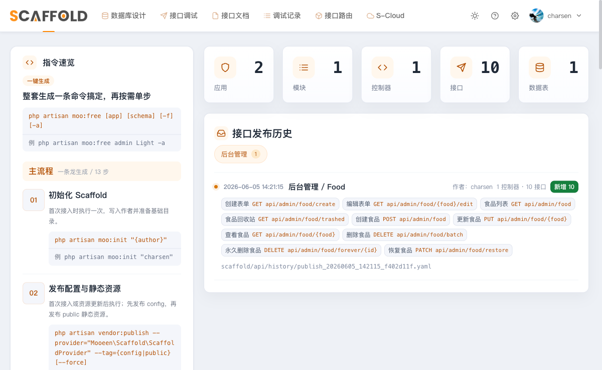
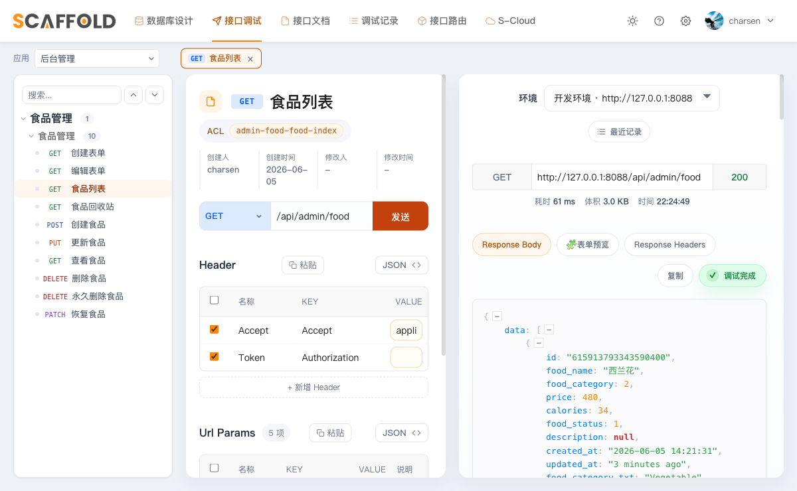

# 第 2 章　安装 moo-scaffold，生成 foods 表的业务代码

目标：把私有包 `charsen/moo-scaffold`（代码生成器 + 可视化调试工具）接入项目，
设计一张 `foods` 表，一键生成全套 CRUD 业务代码，并用两种方式真机调试接口。

---

## 2.1 接入私有包：开发用 path、生产用 vcs

`moo-scaffold` 没有发布到 Packagist，是放在 Gitee 的私有包。
**前置条件**：`moo-scaffold/`、`moo-system/` 两个包的源码已经克隆在与本仓库**同级**的目录
（没有的话先找作者要权限克隆，否则下面第一步就会报 "path repository ... does not exist"）。

接入前要先在 `engine/composer.json` 里声明 `repositories`。两种模式按环境选：

**开发环境（path 相对路径，改源码实时生效）** —— 本教程用这种：

```json
"require": {
    "charsen/moo-scaffold": "dev-master as 3.999.0"
},
"repositories": {
    "scaffold": { "type": "path", "url": "../../moo-scaffold" },
    "system":   { "type": "path", "url": "../../moo-system" }
},
"minimum-stability": "stable",
"prefer-stable": true
```

> 为什么是 `../../moo-scaffold`？因为 Laravel 应用在 `moo-engine-skeleton/engine/` 下，
> 而 `moo-scaffold/` 与 `moo-engine-skeleton/` 同级，从 `engine/` 往上两级正好到 `wwwroot/`。
>
> 为什么现在就声明 `system` 仓库？第 3 章才装 moo-system，但 composer **不会**读
> 依赖包自带的 repositories 声明——host 必须把两个私有仓库都列出来，干脆一次写好。
>
> 为什么是 `dev-master as 3.999.0`？path/dev 分支没有版本号，用 `as 3.999.0`
> 把 dev 分支「假装」成一个很高的稳定版本号，这样 `minimum-stability: stable` 不会拒绝它，
> `moo-system` 里 `"charsen/moo-scaffold": "^3.0"` 这种约束也能满足。

**生产环境（vcs 私有仓库，锁 tag）** —— 部署时换成：

```json
"repositories": {
    "scaffold": { "type": "vcs", "url": "git@gitee.com:charsen/moo-scaffold.git" }
},
"require": { "charsen/moo-scaffold": "^3.0" }
```

生产机需要配 Gitee **部署公钥（只读 SSH key）**。常见做法是维护两份文件：开发用
`composer.json`(path)，生产用 `composer.production.json`(vcs)，部署脚本里
`cp composer.production.json composer.json && composer install --no-dev`。

声明好之后安装：

```bash
cd engine
composer update charsen/moo-scaffold --with-all-dependencies
php artisan list | grep moo     # 看到 moo:init / moo:free / moo:api 等命令即成功
```

## 2.2 初始化 + 发布资源

```bash
php artisan moo:init "charsen"          # 写 SCAFFOLD_AUTHOR 到 .env，建 scaffold/ 目录
php artisan vendor:publish --provider="Mooeen\Scaffold\ScaffoldProvider" --tag=config
php artisan vendor:publish --provider="Mooeen\Scaffold\ScaffoldProvider" --tag=public --force
```

得到 `config/scaffold.php`（可改 route 前缀 / hosts / 各种开关）和
`public/vendor/scaffold/*`（调试工具的前端静态资源）。

> ⚠️ 用 path 模式时，改了包里的 JS/CSS，每个项目都要重新 `--tag=public --force`，
> 否则浏览器看到的还是旧资源。

## 2.3 给生成器留路由插入口 + 注册 iResource 宏

生成器会把新路由插到 `routes/admin.php` / `routes/api.php` 的标记位置，标记不能删。
新建这两个文件（Laravel 12 默认没有它们）：

`routes/admin.php`：
```php
<?php declare(strict_types=1);
use Illuminate\Support\Facades\Route;

Route::get('/', static fn () => 'Hello admin api ~');

// 第 6 章会给这个 group 加上 JWT + ACL 中间件，标记行不能删
Route::group([], function () {
    // :insert_code_here:do_not_delete
});
```

`routes/api.php`：
```php
<?php declare(strict_types=1);
use Illuminate\Support\Facades\Route;

Route::get('/', static fn () => 'Hello app api ~');

// :insert_code_here:do_not_delete
```

在 `bootstrap/app.php` 的 `withRouting()` 里用 `then:` 挂载它们
（**第 3 章**会把这段换成 `using:` 并给挂载点指定中间件组，这里先用最简形式）：
```php
->withRouting(
    web: __DIR__.'/../routes/web.php',
    commands: __DIR__.'/../routes/console.php',
    health: '/up',
    then: function (): void {
        Route::prefix('api/admin')->name('admin.')->group(base_path('routes/admin.php'));
        Route::prefix('app')->name('app.')->group(base_path('routes/api.php'));
    },
)
```

生成的后台控制器路由用了 `Route::iResource(...)` 宏，先注册在
`app/Providers/AppServiceProvider.php` 的 `boot()` 里（比 `Route::resource`
多了回收站 / 永久删除 / 批量删除 / 恢复四条路由）。
**预告**：第 3 章装 moo-system 时它会报错，要挪到 `register()`——那是个值得亲手踩的坑，
这里先照写：
```php
Route::macro('iResource', function (string $name, string $controller, array $options = []) {
    Route::get($name.'/trashed', $controller.'@trashed')->name($name.'.trashed');
    Route::delete($name.'/forever/{id}', $controller.'@forceDestroy')->name($name.'.forceDestroy');
    Route::delete($name.'/batch', $controller.'@destroyBatch')->name($name.'.destroyBatch');
    Route::patch($name.'/restore', $controller.'@restore')->name($name.'.restore');
    Route::resource($name, $controller, $options);
});
```

## 2.4 建调试工具的登录账号

`/scaffold` 调试后台需要登录，账号在 `scaffold/accounts.yaml`：

```bash
php artisan moo:account:add charsen --password=skeleton2026 --role=admin
```

## 2.5 设计 foods 表

```bash
php artisan moo:schema Food     # 生成 scaffold/database/Food.yaml 模板，然后编辑它
```

`scaffold/database/Food.yaml`（节选，完整见仓库）：
```yaml
module:
    name: 食品管理
    folder: Food
tables:
    foods:
        model: { class: Food }
        controller: { app: ['admin'], class: FoodController }
        attrs: { name: 食品, desc: 存储食品基础信息（新手教程示例表） }
        index:
            id: { type: primary, fields: id }
            food_name: { type: index, fields: food_name }
        fields:
            id: { }
            food_name: { name: 名称, type: varchar, size: '2,128', unique: true }
            food_category: { name: 分类, type: tinyint, default: 1 }
            price: { name: 价格, type: int, default: 0, desc: '单位：分' }
            calories: { required: false, name: 热量, type: int, default: 0 }
            food_status: { name: 状态, type: tinyint, default: 1 }
            description: { required: false, name: 描述, type: varchar, size: 255 }
            deleted_at: { }
            created_at: { }
            updated_at: { }
        enums:
            food_category: { fruit: [1, fruit, 水果], vegetable: [2, vegetable, 蔬菜], meat: [3, meat, 肉类], staple: [4, staple, 主食] }
            food_status:   { on_shelf: [1, on shelf, 上架], off_shelf: [2, off shelf, 下架] }
```

## 2.6 一键生成业务代码

```bash
php artisan moo:fresh                 # 解析 yaml 到 storage/scaffold 缓存（改完 yaml 必跑）
php artisan moo:free admin Food -a    # 生成 Model/Controller/Request/路由/i18n/ACL/迁移/API 文档
```

> `moo:free` 末尾会问「是否执行迁移」——选 **yes**。手滑选了 no 也没关系，
> 事后补一句 `php artisan migrate` 即可，否则下面 `DESCRIBE foods` 会查不到表。

生成的目录结构：
```
app/Models/Food/{Food.php, Filters/FoodFilter.php, Traits/FoodTrait.php, Enums/{FoodCategory,FoodStatus}.php}
app/Models/Traits/{UsingSnowFlakePrimaryKey.php, HasOperator.php}   # 雪花 ID 等约定 trait（自动生成）
app/Admin/Controllers/Food/{FoodController.php, Traits/FoodTrait.php}
app/Admin/Requests/Food/Food/{Index,Store,Update,Create,Edit,DestroyBatch}Request.php
# 没有单独的 FoodResource —— 控制器直接用包里的 BaseResource，这是这套架构的常态
database/migrations/*_create_foods_table.php
```

### ⚠️ 新手会遇到的 4 个坑（本教程实测）

1. **生成的 Model 依赖两个约定包**，全新项目里没装会报
   `Trait "EloquentFilter\Filterable" not found` / 找不到 `Godruoyi\Snowflake`。装上即可：
   ```bash
   composer require "tucker-eric/eloquentfilter:^3.0" "godruoyi/php-snowflake:^3.2"
   ```
   （这俩也是 `moo-system` 的依赖，提前装好后面不冲突。）

2. **`moo:free` 不会创建共享的 `BaseActionTrait`**（它只在独立命令 `moo:controller` 里创建）。
   报 `Trait "App\Admin\Controllers\Traits\BaseActionTrait" not found` 时，跑一次：
   ```bash
   php artisan moo:controller Food -f
   ```

3. **`moo:free` 里的 `moo:auth` / `moo:api` 可能提示 “No routes matched”**，
   因为路由是同一个进程里刚插进文件的、当前路由表还没刷新。生成完单独补一次即可：
   ```bash
   php artisan moo:api admin Food
   ```

4. **接口调试器的代理会和单线程 `php artisan serve` 死锁**：调试器发请求时，后端要再向
   「自己」发一次 HTTP 代理请求，单进程服务器处理不了并发会一直转圈。解决办法是开多 worker：
   ```bash
   PHP_CLI_SERVER_WORKERS=4 php artisan serve --host=127.0.0.1 --port=8088 --no-reload
   ```
   （必须带 `--no-reload`，否则 Laravel 只起单 worker。）

生成的 `foods` 表（注意 `id` 是非自增 bigint，留给雪花算法赋值）：
```bash
mysql -uroot -p7777 -h127.0.0.1 moo_skeleton -e "DESCRIBE foods;"
```

## 2.7 真机调试接口（两种方式）

> **来自第 6 章的更新**：food 路由后来上了 JWT + ACL（见第 6 章），本节的无 token 玩法
> 只在「刚做完本章、还没做第 6 章」的状态下成立。已做完第 6 章的话，先按第 4 章登录
> 拿 token，下面的 curl 加上 `-H "Authorization: Bearer $TOKEN"` 即可，其余照旧。

开打之前确认服务起着，而且必须是**多 worker** 方式（坑 4，调试器代理会和单线程死锁）：

```bash
PHP_CLI_SERVER_WORKERS=4 php artisan serve --host=127.0.0.1 --port=8088 --no-reload
```

### 方式一：命令行 curl 直接打

```bash
# 新增
curl -s -X POST http://127.0.0.1:8088/api/admin/food \
  -H "Accept: application/json" -H "Content-Type: application/json" \
  -d '{"food_name":"红富士苹果","food_category":1,"price":350,"calories":52,"food_status":1,"description":"脆甜多汁"}'
# 列表
curl -s "http://127.0.0.1:8088/api/admin/food?page=1&page_limit=10" -H "Accept: application/json"
```

返回是 moo 体系的响应约定：成功直接返回 `{data: ...}`（列表还带 `meta` 分页和 `columns` 表头），
`id` 是雪花字符串，枚举自动带 `food_category_txt` / `food_status_txt` 文案。

### 方式二：用 moo-scaffold 内置的接口调试器（浏览器真机）

先把 `config/scaffold.php` 的 hosts 开发环境指向本机：
```php
'hosts' => [
    '开发环境' => 'http://127.0.0.1:8088',
    '正式环境' => 'https://example.com',
],
```

浏览器打开 `http://127.0.0.1:8088/scaffold` 用 charsen 登录，首页能看到刚生成的 Food 模块：



进「接口调试」→ 选「后台管理」→ 展开「食品管理」→ 点「食品列表」，自动按接口文档回填参数并发请求，
右侧拿到 `200` 实时响应：



---

## 本章产出

- `moo-scaffold` 以 path 模式接入，21 个 `moo:*` 命令可用（`php artisan list | grep moo` 可数）；
- 一张 `foods` 表从 YAML 设计到全套业务代码、迁移落库；
- 接口用 curl 和内置调试器两种方式真机验证通过（HTTP 200）。

下一章：安装 **moo-system**，把部门 / 岗位 / 人员 / 角色等系统管理模块接进来。
