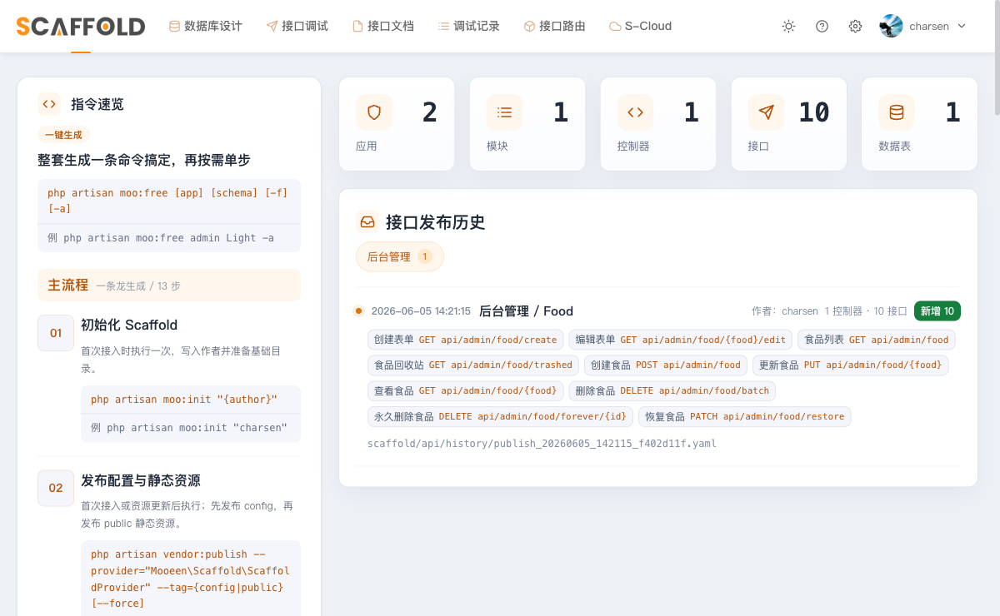
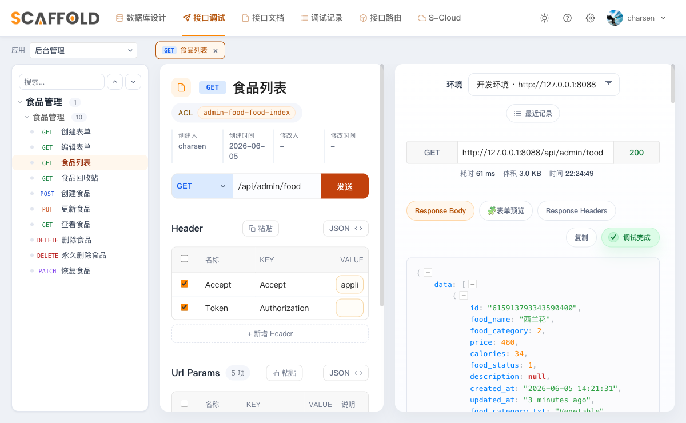

# 第 2 章　安装 moo-scaffold，生成 foods 表的业务代码

目标：安装 `moo-scaffold`，设计 `foods` 表，生成 CRUD，并完成接口验证。

> 仓库保存的是全书最终代码，可能比本章示例多。跟做时以正文为准。

---

## 2.1 接入 moo-scaffold：开源包（正式版本）

`moo-scaffold` 是运行时依赖，不要加 `--dev`。在 `engine/` 目录直接安装稳定版本：

```bash
composer require "charsen/moo-scaffold:^2.1.3"
php artisan list | grep moo     # 看到 moo:init / moo:free / moo:api 等命令即成功
```

Composer 会更新 `composer.json` 和 lock；已安装的 monitor 兼容时直接复用，
版本偏低时会自动升级。

`moo:free` 会生成 Pest 测试，先安装测试依赖：

```bash
composer config allow-plugins.pestphp/pest-plugin true
composer require --dev "pestphp/pest:^3.8" "pestphp/pest-plugin-laravel:^3.2" --with-all-dependencies
./vendor/bin/pest --init     # 末尾询问是否 star GitHub 时选 no 即可
```

## 2.2 初始化 + 发布资源

```bash
php artisan moo:init "charsen"          # 写 SCAFFOLD_AUTHOR 到 .env，建 scaffold/ 目录
php artisan vendor:publish --provider="Mooeen\Scaffold\ScaffoldProvider" --tag=config
php artisan vendor:publish --provider="Mooeen\Scaffold\ScaffoldProvider" --tag=public --force
```

得到 `config/scaffold.php`（可改 route 前缀 / hosts / 各种开关）和
`public/vendor/scaffold/*`（调试工具的前端静态资源）。

> ⚠️ 更新了包里的 JS/CSS 后，每个项目都要重新 `--tag=public --force`，
> 否则浏览器看到的还是旧资源。

## 2.3 给生成器留路由插入口 + 注册 iResource 宏

生成器会把新路由插到 `routes/admin.php` / `routes/mobi.php` 的标记位置，标记不能删。
新建这两个文件（Laravel 12 默认没有它们）。

先记住一个容易绕晕的对应关系——**文件名说的是「给谁用」，URL 前缀是另一回事**：

| 路由文件 | 给谁用 | 挂载的 URL 前缀 |
| --- | --- | --- |
| `routes/admin.php` | 后台管理接口 | `/api/admin` |
| `routes/mobi.php` | 客户端（App / 移动端）接口 | `/app` |

`mobi.php` 表示消费者是移动端，外部 URL 仍可按 host 契约挂在 `/app`；`api` 一词保留给接口文档、调试页面和真实 URL 语义，不再兼作移动端目录名。

> 仓库中的文件已经包含后续章节内容。本章先写下面的最小骨架。

`routes/admin.php`：
```php
<?php declare(strict_types=1);
use Illuminate\Support\Facades\Route;

Route::get('/', static fn () => 'Hello admin api ~');

// 第 5 章会给这个 group 加上 JWT + ACL 中间件，标记行不能删
Route::group([], function () {
    // :insert_code_here:do_not_delete
});
```

`routes/mobi.php`：
```php
<?php declare(strict_types=1);
use Illuminate\Support\Facades\Route;

Route::get('/', static fn () => 'Hello app api ~');

// :insert_code_here:do_not_delete
```

在 `bootstrap/app.php` 的 `withRouting()` 里用 `then:` 挂载路由。第 3 章接入中间件组时，
会再改为 `using:`：
```php
->withRouting(
    web: __DIR__.'/../routes/web.php',
    commands: __DIR__.'/../routes/console.php',
    health: '/up',
    then: function (): void {
        Route::prefix('api/admin')->name('admin.')->group(base_path('routes/admin.php'));
        Route::prefix('app')->name('app.')->group(base_path('routes/mobi.php'));
    },
)
```

> ⚠️ 上面闭包里用了 `Route::`，但 Laravel 12 默认的 `bootstrap/app.php` **没有** import Route 门面。
> 跟做时务必在该文件顶部补一行 `use Illuminate\Support\Facades\Route;`，否则运行即
> `Fatal error: Class "Route" not found`（仓库 `engine/bootstrap/app.php` 顶部就有这行）。

生成的控制器路由使用 `Route::iResource(...)` 宏。这是 host 项目必须提供的
路由契约，从一开始就注册在 `AppServiceProvider::register()`：它要早于所有 provider 的
`boot()` 执行，后面可选安装 `moo-system` 时才不会出现
`Attribute [iResource] does not exist`。

具体植入位置是 **`engine/app/Providers/AppServiceProvider.php`**（如果当前终端已经在
`engine/` 目录，就是 `app/Providers/AppServiceProvider.php`）：

**第一步：导入 Route 门面。** 在文件顶部、`namespace App\Providers;` 后面的 `use` 区域加入：

```php
use Illuminate\Support\Facades\Route;
```

**第二步：注册宏。** 在 `AppServiceProvider` 类现有的 `register()` 方法**内部**加入下面的
`Route::macro(...)`。全新 Laravel 已经有一个空的 `register()`，直接把宏放进方法体即可；
如果方法里已有其他注册代码，就追加进去，**不要再声明第二个 `register()` 方法**。

宏不能直接包一层 `Route::resource`：这套生态的控制器方法并不完全相同，
无条件注册会生成调用不存在方法的“幻影路由”。使用反射只注册真实存在且
`public` 的 action，并注意固定路径必须早于 `/{id}`：

```php
public function register(): void
{
    Route::macro('iResource', function (string $name, string $controller) {
        $hasAction = static function (string $action) use ($controller): bool {
            if (! class_exists($controller)) {
                return false;
            }

            $reflection = new \ReflectionClass($controller);

            return $reflection->hasMethod($action)
                && $reflection->getMethod($action)->isPublic();
        };

        if ($hasAction('index')) {
            Route::get($name, [$controller, 'index'])->name($name.'.index');
        }
        if ($hasAction('create')) {
            Route::get($name.'/create', [$controller, 'create'])->name($name.'.create');
        }
        if ($hasAction('store')) {
            Route::post($name, [$controller, 'store'])->name($name.'.store');
        }
        if ($hasAction('trashed')) {
            Route::get($name.'/trashed', [$controller, 'trashed'])->name($name.'.trashed');
        }
        if ($hasAction('show')) {
            Route::get($name.'/{id}', [$controller, 'show'])->name($name.'.show');
        }
        if ($hasAction('edit')) {
            Route::get($name.'/{id}/edit', [$controller, 'edit'])->name($name.'.edit');
        }
        if ($hasAction('update')) {
            Route::put($name.'/{id}', [$controller, 'update'])->name($name.'.update');
        }
        if ($hasAction('forceDestroy')) {
            Route::delete($name.'/forever/{id}', [$controller, 'forceDestroy'])
                ->name($name.'.forceDestroy');
        }
        if ($hasAction('destroyBatch')) {
            Route::delete($name.'/batch', [$controller, 'destroyBatch'])
                ->name($name.'.destroyBatch');
        }
        if ($hasAction('destroy')) {
            Route::delete($name.'/{id}', [$controller, 'destroy'])->name($name.'.destroy');
        }
        if ($hasAction('restore')) {
            Route::patch($name.'/restore', [$controller, 'restore'])->name($name.'.restore');
        }
    });
}
```

## 2.4 建调试工具的登录账号

`/scaffold` 调试后台需要登录，账号在 `scaffold/accounts.yaml`：

```bash
php artisan moo:account:add charsen --password=skeleton2026 --role=admin
```

加完**立刻验证**：起服务（`php artisan serve --host=127.0.0.1 --port=8088`，
此时还用不到调试器代理，单 worker 就行），浏览器打开
`http://127.0.0.1:8088/scaffold` 用上面的账号密码登录一次——
密码敲错现在就能发现，不用等到 2.7 才暴露。

## 2.5 设计 foods 表

```bash
php artisan moo:schema Food     # 生成 scaffold/database/Food.yaml 模板，然后编辑它
```

`scaffold/database/Food.yaml`（本章时点的形态；仓库版是**第 9 章演进后**的样子——
多了 `stock` 字段、`controller.app` 变成 `['admin', 'mobi']`、还新增了
`resource: ['admin']` 和 `attrs.remark`，对不上是正常的）：
```yaml
module:
    name: 食品管理
    folder: Food
tables:
    foods:
        model: { class: Food }
        controller: { app: ['admin'], class: FoodController }
        attrs: { name: 食品, desc: 存储食品基础信息（新手教程示例表） }
        index:
            id: { type: primary, fields: id }
            food_name: { type: index, fields: food_name }
        fields:
            id: { }
            food_name: { name: 名称, type: varchar, size: '2,128', unique: true }
            food_category: { name: 分类, type: tinyint, default: 1 }
            price: { name: 价格, type: int, default: 0, desc: '单位：分' }
            calories: { required: false, name: 热量, type: int, default: 0 }
            food_status: { name: 状态, type: tinyint, default: 1 }
            description: { required: false, name: 描述, type: varchar, size: 255 }
            deleted_at: { }
            created_at: { }
            updated_at: { }
        enums:
            food_category: { fruit: [1, fruit, 水果], vegetable: [2, vegetable, 蔬菜], meat: [3, meat, 肉类], staple: [4, staple, 主食] }
            food_status:   { on_shelf: [1, on shelf, 上架], off_shelf: [2, off shelf, 下架] }
```

注意两点：

- **`id: { }` / `deleted_at: { }` / `created_at: { }` 为什么是空的？** 这些是**约定字段**，
  留空即可——生成器会自动补全类型（`id` 是雪花算法主键，见 2.6 末尾的表结构）。
- **同目录还会出现一个 `scaffold/database/_fields.yaml`**——它是生成命令自动创建、
  维护的**字段翻译润色文件**（`table_fields` 随库表字段自动增、减；你手改的翻译
  不会被重新生成覆盖），**不用手写**，看到它别慌。

## 2.6 生成业务代码

先确认数据库连接没问题——`moo:free` 末尾要执行迁移，连不上库会失败：

```bash
php artisan migrate:status    # 能列出迁移即说明 .env 的 DB_* 配置可用（第 1 章配的）
```

然后生成：

```bash
php artisan moo:fresh                 # 解析 yaml 到 storage/scaffold 缓存（改完 yaml 必跑）
php artisan moo:free admin Food -a    # 生成 Model/Controller/Request/路由/i18n/ACL/迁移/API 文档
```

> `moo:free` 末尾会问「是否执行迁移」——选 **yes**。手滑选了 no 也没关系，
> 事后补一句 `php artisan migrate` 即可，否则下面 `DESCRIBE foods` 会查不到表。

生成的目录结构：
```
app/
├── Models/Food/
│   ├── Food.php
│   ├── Filters/FoodFilter.php
│   ├── Traits/FoodTrait.php
│   └── Enums/{FoodCategory,FoodStatus}.php
└── Admin/
    ├── Controllers/Traits/BaseActionTrait.php
    ├── Controllers/Food/
    │   ├── FoodController.php
    │   └── Traits/FoodTrait.php
    └── Requests/Food/Food/
        ├── {Index,Store,Update}Request.php
        ├── {Create,Edit,DestroyBatch}Request.php
        └── FoodRequestTrait.php

database/migrations/*_create_foods_table.php
tests/Feature/Admin/Food/FoodControllerTest.php
```

其中 `BaseActionTrait.php` 是生成的共享 CRUD 动作，`FoodRequestTrait.php` 是各 Request
共用的表名 / 枚举值 trait。这里不会生成单独的 `FoodResource`，控制器直接使用包里的
`BaseResource`，这是这套架构的常态。

> 雪花 ID 能力来自包内 `Mooeen\Scaffold\Concerns\UsingSnowFlakePrimaryKey`，
> 当前版本不会在 `app/Models/Traits/` 再生成同名 trait。本章 schema 也没有
> `creator_id` / `updater_id`，因此不会生成 host 侧 `HasOperator`。

- **`Requests/Food/Food/` 双层 Food 不是生成错了**：第一层是模块目录
  （YAML 里的 `module.folder: Food`），第二层是表模型名（`Food`）——
  本例俩恰好同名才显得重复；模块目录换个名（比如 `Catalog`）就是 `Catalog/Food/`。
- 📌 **对照仓库时的两处差异**：① `app/Models/Traits/` 里仓库还有一个
  `MediaSynchronous.php`——那是**第 7 章**为 Host Notification 准备的媒体 URL helper，
  不是 moo-system 契约，也不是本章生成物；
  ② 「没有单独的 FoodResource」是本章时点的事实，**第 9 章 9.9 节**为定制列表字段
  新增了 `app/Admin/Resources/Food/FoodResource.php`，`FoodController` 的
  index/show 改用了它（store/update 等仍用 BaseResource）。本章生成完没有这两样，正常。

### 2.6.1 生成结果自检

`moo:free` 完成后，立即验证路由、ACL/API 产物和测试：

```bash
php artisan route:list --path=api/admin/food
test -f scaffold/acl/admin.yaml
test -f scaffold/api/admin/Food/Food.yaml
php artisan test tests/Feature/Admin/Food
```

应该看到 Food 资源路由，生成的契约测试全部通过。如果 `moo:free` 里的
`moo:auth` / `moo:api` 提示没有路由匹配，先检查 2.3 的路由插入标记和
`iResource` 宏；确认 Food 路由已经生成后，再单独执行：

```bash
php artisan moo:auth admin
php artisan moo:api admin Food
```

还有一个运行时注意点：**接口调试器的代理会和单线程
`php artisan serve` 死锁**。调试器发请求时，后端要再向
「自己」发一次 HTTP 代理请求，单进程服务器处理不了并发会一直转圈。解决办法是开多 worker：

```bash
PHP_CLI_SERVER_WORKERS=4 php artisan serve --host=127.0.0.1 --port=8088 --no-reload
```

（必须带 `--no-reload`，否则 Laravel 只起单 worker。）

### 2.6.2 校准列表筛选入参（别让 Filter 成为死代码）

当前生成器会在 `FoodFilter` 里生成 `price()` / `calories()` /
`description()` / 日期筛选方法，但 `IndexRequest` 默认只放行名称和枚举字段。
控制器调用的是 `->filter($request->validated())`：**没写进 rules 的查询参数会被丢掉**，
所以 Filter 方法看似存在、实际永远不会执行。

把 `app/Admin/Requests/Food/Food/IndexRequest.php` 的 `rules()` 整理成：

```php
public function rules(): array
{
    return [
        'food_name'     => ['nullable', 'string', 'max:128'],
        'description'   => ['nullable', 'string', 'max:255'],
        'price'         => ['nullable', 'integer', 'min:0'],
        'calories'      => ['nullable', 'integer', 'min:0'],
        'food_category' => ['nullable', 'integer', $this->getInEnums($this->getValues('food_category'))],
        'food_status'   => ['nullable', 'integer', $this->getInEnums($this->getValues('food_status'))],
        'created_at'    => ['nullable', 'date'],
        'updated_at'    => ['nullable', 'date'],
        'deleted_at'    => ['nullable', 'date'],
        'page'          => ['required', 'integer', 'min:1'],
        'page_limit'    => ['required', 'integer', 'min:1', 'max:200'],
    ];
}
```

`page_limit` 的 200 上限也是业务保护：不限制时，任何客户端都可一次要求数万条数据。
真实验证这两条契约：

```bash
# 先用 2.7 的新增接口建两条不同价格的数据，然后：
curl -s "http://127.0.0.1:8088/api/admin/food?page=1&page_limit=10&price=350"
# meta.total 应只统计 price=350 的数据

curl -s -o /dev/null -w "%{http_code}\n" \
  "http://127.0.0.1:8088/api/admin/food?page=1&page_limit=10000"
# 422
```

生成的 `foods` 表（注意 `id` 是非自增 bigint，留给雪花算法赋值。
`-p7777` / `moo_engine_from_zero` 来自**第 1 章** `.env` 里的 `DB_PASSWORD` / `DB_DATABASE`，
按你自己的配置替换）：
```bash
mysql -uroot -p7777 -h127.0.0.1 moo_engine_from_zero -e "DESCRIBE foods;"
```

## 2.7 真机调试接口（两种方式）

> **来自第 5 章的更新**：food 路由后来上了 JWT + ACL（见第 5 章），本节的无 token 玩法
> 只在「刚做完本章、还没做第 5 章」的状态下成立。已做完第 5 章的话，先按第 3 章登录
> 拿 token，下面的 curl 加上 `-H "Authorization: Bearer $TOKEN"` 即可，其余照旧。

开打之前确认服务起着，而且必须是**多 worker** 方式（坑 4，调试器代理会和单线程死锁）：

```bash
PHP_CLI_SERVER_WORKERS=4 php artisan serve --host=127.0.0.1 --port=8088 --no-reload
```

### 方式一：命令行 curl 直接打

> **URL 为什么是单数 `food` 不是 `foods`？** 表名（复数 `foods`）只决定数据库表；
> 资源路由名取的是**模型名（单数）的小写**——`moo:free admin Food` 生成的是
> `Route::iResource('food', FoodController::class)`，所以 URL 是 `/api/admin/food`。

```bash
# 新增
curl -s -X POST http://127.0.0.1:8088/api/admin/food \
  -H "Accept: application/json" -H "Content-Type: application/json" \
  -d '{"food_name":"红富士苹果","food_category":1,"price":350,"calories":52,"food_status":1,"description":"脆甜多汁"}'
# 列表
curl -s "http://127.0.0.1:8088/api/admin/food?page=1&page_limit=10" -H "Accept: application/json"
```

返回是 moo 体系的响应约定：成功直接返回 `{data: ...}`（列表还带 `meta` 分页和 `columns` 表头），
`id` 是雪花字符串，枚举自动带 `food_category_txt` / `food_status_txt` 文案。

### 方式二：用 moo-scaffold 内置的接口调试器（浏览器真机）

先把 `config/scaffold.php` 的 hosts 开发环境指向本机：
```php
'hosts' => [
    '开发环境' => 'http://127.0.0.1:8088',
    '正式环境' => 'https://example.com',
],
```

浏览器打开 `http://127.0.0.1:8088/scaffold` 用 charsen 登录，首页能看到刚生成的 Food 模块：



进「接口调试」→ 选「后台管理」→ 展开「食品管理」→ 点「食品列表」，自动按接口文档回填参数并发请求，
右侧拿到 `200` 实时响应：



---

## 本章产出

- `moo-scaffold` 以正式版本约束方式接入，`php artisan list | grep moo`
  能列出 `moo:init` / `moo:free` / `moo:api` 等命令；
- 一张 `foods` 表从 YAML 设计到全套业务代码、迁移落库；
- 接口用 curl 和内置调试器两种方式真机验证通过（HTTP 200）。

下一章：**不依赖任何付费包**，用自建的最简用户把 JWT 登录认证跑通。
