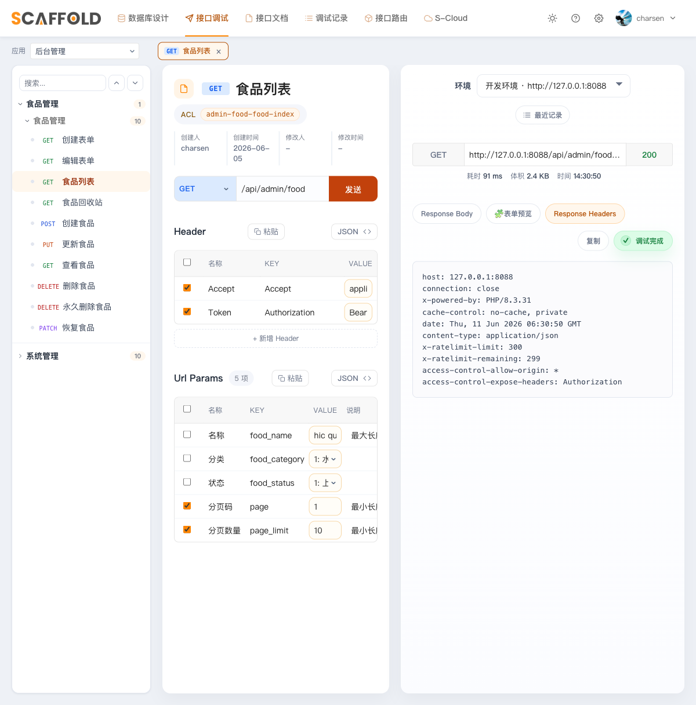

# 第 4 章　JWT 加固与生产化

目标：补齐 JWT 的续签、黑名单、CORS、限流和异常处理，并用测试固定行为。

> “坑 #N”可在[总览速查表](./README.md)查询。仓库保存最终代码，与本章不同时以正文为准。

---

## 4.1 加固 `config/jwt.php`（5 处）

推荐逐处核对下面 5 处（理解每个配置的作用）。如果希望直接使用完整配置，
也可以参考本仓库 `engine/config/jwt.php`（该文件后续章节不再改动，注释已全部中文化）。

**关键配置 5 处**：

**① 续签时保留 guard 声明**：jwt-auth 2.8.x 续签时不会自动保留自定义声明，
缺少 `guard` 会导致下一次请求返回 401：

```php
'persistent_claims' => [
    'guard',
],
```

**② 黑名单宽限期 90 秒** —— 页面并发请求时，第一个触发续签后旧 token 立刻进黑名单，
没有宽限期同批在途请求会全部 401（坑 #11）：

```php
'blacklist_grace_period' => 90,
```

**③ 滑动续期** —— 包默认续期窗口永远从首次登录起算，天天在用也会在第 14 天被踢：

```php
'refresh_iat' => true,   // 每次续签把起算点拨到当下
```

**④ 有效期默认值固化进 config** —— `.env` 里没有 `JWT_TTL` 时，包默认只有 60 分钟。
把团队约定写死进 config，env 只留真正逐环境变化的 `JWT_SECRET`：

```php
'ttl'         => (int) env('JWT_TTL', 2880),           // 2 天
'refresh_ttl' => (int) env('JWT_REFRESH_TTL', 20160),  // 14 天
```

**⑤ 显式启用黑名单异常**：缺少这个配置时，已拉黑的 token 可能被继续放行：

```php
'show_black_list_exception' => env('JWT_SHOW_BLACKLIST_EXCEPTION', true),
```

> moo-system 的撤销会话、改密和禁用踢下线都依赖黑名单，因此这里必须保持 `true`。

> 顺带认识 `engine/config/jwt.php` 里另一个与认证主体相关的**既有键**（包默认就有、
> 保持 `true` 即可，不算本次 5 处改动）：`'lock_subject' => true` —— 它往 token 里写入
> `prv` 字段（主体模型类名的 sha1 哈希）并在校验时比对，防止两个不同模型恰好同 id 时
> 拿 A 模型的 token 冒充 B 模型。4.9 节真机验证还会遇到它。

## 4.2 新建 `config/cors.php`

无感续签的新 token 放在 `authorization` **响应头**里。CORS 默认不暴露任何响应头，
跨域场景（H5 / 前后端分离调试）下浏览器拿不到新 token，旧 token 出宽限期就 401（坑 #12）。

新建 `engine/config/cors.php`（Laravel 12 的 HandleCors 默认就在全局中间件里，发布配置即生效）：

```php
'paths' => ['api/*', 'app/*'],
'exposed_headers' => ['Authorization'],   // 关键行
```

注意 Laravel 12 默认**不发布** `config/cors.php`（框架用内置默认值），所以"其余键照抄默认"
之前要先把默认文件发布出来再改上面两行：

```bash
php artisan config:publish cors
```

**完整的 `config/cors.php` 配置示例**：

```php
<?php

return [
    'paths' => ['api/*', 'app/*', 'sanctum/csrf-cookie'],
    'allowed_methods' => ['*'],
    'allowed_origins' => ['*'],
    'allowed_origins_patterns' => [],
    'allowed_headers' => ['*'],
    'exposed_headers' => ['Authorization'],  // ← 关键：暴露 Authorization 头
    'max_age' => 0,
    'supports_credentials' => false,
];
```

> 说明：`exposed_headers` 必须包含 `Authorization`，否则前端无法读取响应头中的新 token（无感续签失效）。
> 其余配置可根据生产环境安全要求收紧（如 `allowed_origins` 改为白名单）。

## 4.3 登录补账号状态检查

第 3 章的登录只校验了密码——被停用的账号照样能登录。改的是第 3 章创建的
`engine/app/Admin/Controllers/AuthController.php`：自建 users 表最现成的状态位
是 `email_verified_at`，在 `authenticate()` 里的 `Hash::check` 之后补一段：

```php
// 最简状态检查：未验证邮箱不允许登录（自建表的"激活"语义）
if ($user->email_verified_at === null) {
    throw ValidationException::withMessages(['email' => ['帐号尚未激活（邮箱未验证）。']]);
}
```

> 第 7 章切换到 Personnel 后，会改为检查 `account_status`。

## 4.4 `/refresh` 路由单独挂中间件

第 3 章把 `refresh` 放进了 `jwt.auth.refresh` 那个组——**要移出来**（坑 #18）：
那个中间件会对过期 token 先自动续签一次（新 token 放响应头），控制器再续签第二次
（放响应体），一个旧 token 就派生出两个有效新 token，响应头那个永远不会作废。

改 `routes/admin.php`：

```php
// 主动刷新：只校验 guard claim，不挂 jwt.auth.refresh
Route::post('refresh', [AuthController::class, 'refresh'])
    ->middleware('jwt.guard.auth:admin')->name('refresh');

// 需要登录（JWT 强制认证 + 近过期续签）
Route::group(['middleware' => ['jwt.guard.auth:admin', 'jwt.auth.refresh']], function () {
    Route::get('me/info', [AuthController::class, 'me'])->name('me.info');
});
```

控制器里 `refresh()` 对应改成"自己处理异常"：

```php
// use PHPOpenSourceSaver\JWTAuth\Exceptions\JWTException;
// use Symfony\Component\HttpKernel\Exception\UnauthorizedHttpException;
public function refresh(): JsonResponse
{
    try {
        // forceForever=false：旧 token 走 90 秒宽限；resetClaims=false：保留 guard
        $token = Auth::guard('admin')->refresh(false, false);
    } catch (JWTException $e) {
        // 无 token / 伪造 / 超出续期窗口 / 已拉黑 → 重新登录
        throw new UnauthorizedHttpException('jwt-auth', $e->getMessage());
    }

    return response()->json(['data' => [
        'token' => $token,
        'expires_in' => Auth::guard('admin')->factory()->getTTL() * 60,
    ]]);
}
```

和它对照，第 3 章写的 `logout()` 走的是**永久拉黑**（4.9 节验证表第 8 行验的就是这个差别），
顺手确认一下你的实现是这样：

```php
public function logout(): JsonResponse
{
    Auth::guard('admin')->logout(true);   // forceForever=true：立即作废，不吃 90 秒宽限

    return response()->json(['message' => 'ok']);
}
```

> 同一个 `forceForever` 参数、两种取值：`refresh` 传 `false`——旧 token 留 90 秒宽限，
> 保护同批在途的并发请求；`logout` 传 `true`——用户主动登出，立刻失效才符合预期。
> 两处不矛盾，是各自场景的正确选择。
>
> refresh 本身就接受"过期但在续期窗口内"的 token，不需要前置强制认证。
> 第 7 章接入 moo-system 后，登录、刷新、退出会分别派发 `SaveLoginJob`、
> `UpdateLoginTokenJob`、调用 `LoginManagement::setInvalidStatus()`，让登录管理记录形成完整生命周期。
> 四个异步队列连接统一使用 `after_commit=true`，外层事务回滚时这些任务不会提前入队。

## 4.5 异常采集与节流（`bootstrap/app.php`）

在 `withExceptions()` 里补三段（第 3 章已有 2 段，本章再加 1 段 BaseException）：

```php
// use Illuminate\Cache\RateLimiting\Limit;
// use Mooeen\Scaffold\Exceptions\BaseException;
// use PHPOpenSourceSaver\JWTAuth\Exceptions\JWTException;
// use Symfony\Component\HttpKernel\Exception\NotFoundHttpException;

// 第 3 章写过的渲染之外，再加：同一异常只报一次 + 预期异常不上报
$exceptions->dontReportDuplicates()->dontReport([
    JWTException::class,
    NotFoundHttpException::class,
    BaseException::class,          // moo-scaffold 的业务异常（522）
]);

// 运行时异常采集由第 1.7 节显式安装的 moo-monitor-laravel 提供；
// MonitorProvider 已自动挂 reportable 钩子，异常落盘 storage/moo-monitor/runtimes，
// 经 moo:cloud:push 推送上云后在云端查看。

// 高频 5xx 时别把关键日志吞了
$exceptions->throttle(fn (Throwable $e) => Limit::perMinute(1000));
```

## 4.6 接口限流

先在 `AppServiceProvider::boot()` 定义限流器：

```php
// use Illuminate\Cache\RateLimiting\Limit;
// use Illuminate\Http\Request;
// use Illuminate\Support\Facades\RateLimiter;
RateLimiter::for('admin', fn (Request $r) => Limit::perMinute(300)->by($r->user()?->id ?: $r->ip()));
RateLimiter::for('mobi', fn (Request $r) => Limit::perMinute(1000)->by($r->user()?->id ?: $r->ip()));
```

再到 `bootstrap/app.php` 的 `withMiddleware()` 中，为 `admin` / `moo-system` 组加一行
`'throttle:admin'`，为 `mobi` 组加 `'throttle:mobi'`
（`moo-system` 组你现在就有——第 3 章注册中间件组时已为第 7 章的商业包**预先建好**，
见第 3 章 `withMiddleware()` 那段，不是你漏装了什么）。

**登录接口要再单独限**：组限流的 300 次/分钟对 `/authenticate` 等于不设防
（爆破一分钟能试 300 个密码）。这里用两个计数桶：同一 IP 对同一账号最多 5 次/分钟，
同时同一 IP 的全部登录请求最多 30 次/分钟，既限制持续猜一个账号，也限制不断换账号扫描。
本章时间点登录路由只有 `routes/admin.php` 一条，给它挂上
`->middleware('throttle:login')`；第 6 章建移动端 `routes/mobi.php` 的登录路由时，
正文会按同样方式挂上：

```php
RateLimiter::for('login', function (Request $r) {
    $account = mb_strtolower(trim((string) ($r->input('account') ?: $r->input('email') ?: '')));

    return [
        Limit::perMinute(5)->by('login-account-ip:'.sha1($account.'|'.$r->ip())),
        Limit::perMinute(30)->by('login-ip:'.$r->ip()),
    ];
});
```

验证：同一账号连错 5 次密码，第 6 次返回 **429**；若不断更换不存在的邮箱，
同一 IP 的第 31 次也返回 **429**。

组限流的验证：随便调一个 admin 接口，响应头出现 `X-RateLimit-Limit: 300` 即生效。
在 scaffold 调试器的 Response Headers 标签里能同时看到限流头和 4.2 节的 CORS 暴露头：



## 4.7 `.env.example` 与生产 composer

这一节同时准备两个“交付给下一位开发者”的文件，但不要改乱你正在运行的环境：

- 当前项目的 `.env` **继续使用第 1 章配好的 MariaDB `moo_engine_from_zero`**；
- `.env.example` 是未来 clone 后复制为 `.env` 的模板，默认用 SQLite，让第一次安装不依赖
  本机已有 MariaDB；正式项目再按第 1 章把自己的 `.env` 切到独立数据库。

先把 `.env.example` **完整替换**为下面内容。这里没有第 7 章才出现的操作日志、雪花 ID 等配置，
避免提前抄入尚未安装的功能：

```dotenv
# 应用
APP_NAME=moo_engine_from_zero
APP_ENV=local
APP_KEY=
APP_DEBUG=true
APP_URL=http://127.0.0.1:8088

APP_LOCALE=en
APP_FALLBACK_LOCALE=en
APP_FAKER_LOCALE=zh_CN
BCRYPT_ROUNDS=12

# scaffold 调试器会回调本服务器；多 worker 可避免单线程自我代理死锁（坑 #4）
PHP_CLI_SERVER_WORKERS=4

# 日志
LOG_CHANNEL=stack
LOG_STACK=single
LOG_LEVEL=debug

# 克隆后的零依赖默认值；正式项目在自己的 .env 中切换到 MySQL / MariaDB
DB_CONNECTION=sqlite
# DB_HOST=127.0.0.1
# DB_PORT=3306
# DB_DATABASE=your_project
# DB_USERNAME=root
# DB_PASSWORD=

# 缓存 / 会话 / 队列
CACHE_STORE=database
SESSION_DRIVER=database
SESSION_LIFETIME=120
QUEUE_CONNECTION=sync
FILESYSTEM_DISK=local
BROADCAST_CONNECTION=log

# 生产多 worker 时把 CACHE_STORE / QUEUE_CONNECTION 换成 redis，并启用这些连接项
# REDIS_CLIENT=phpredis
# REDIS_HOST=127.0.0.1
# REDIS_PASSWORD=null
# REDIS_PORT=6379

# JWT：复制成 .env 后执行 php artisan jwt:secret
JWT_SECRET=

# moo-scaffold：执行 php artisan moo:init "你的名字" 后写入
SCAFFOLD_AUTHOR=

# moo-monitor-laravel
MOO_MONITOR_SQL_SLOW_ENABLED=true
MOO_MONITOR_SQL_SLOW_THRESHOLD_MS=100
MOO_MONITOR_CLOUD_ENABLED=false
MOO_MONITOR_CLOUD_TOKEN=

VITE_APP_NAME="${APP_NAME}"
```

确认模板和当前运行配置没有串台：

```bash
grep '^DB_CONNECTION=' .env .env.example
# .env:DB_CONNECTION=mysql
# .env.example:DB_CONNECTION=sqlite
```

接着在项目根目录新建 `composer.production.json`。这是**第 4 章时间点的完整文件**，
没有尚未安装的 `moo-system`，也不会引用还不存在的 `app/Helpers/helpers.php`：

```json
{
    "$schema": "https://getcomposer.org/schema.json",
    "name": "laravel/laravel",
    "type": "project",
    "description": "The skeleton application for the Laravel framework.",
    "keywords": ["laravel", "framework"],
    "license": "MIT",
    "require": {
        "php": "^8.2",
        "charsen/moo-monitor-laravel": "^0.1",
        "charsen/moo-scaffold": "^2.1.3",
        "laravel/framework": "^12.0",
        "laravel/tinker": "^2.10.1",
        "php-open-source-saver/jwt-auth": "~2.8.3"
    },
    "autoload": {
        "psr-4": {
            "App\\": "app/",
            "Database\\Factories\\": "database/factories/",
            "Database\\Seeders\\": "database/seeders/"
        }
    },
    "scripts": {
        "post-autoload-dump": [
            "Illuminate\\Foundation\\ComposerScripts::postAutoloadDump",
            "@php artisan package:discover --ansi"
        ],
        "post-update-cmd": [
            "@php artisan vendor:publish --tag=laravel-assets --ansi --force"
        ],
        "pre-package-uninstall": [
            "Illuminate\\Foundation\\ComposerScripts::prePackageUninstall"
        ]
    },
    "extra": {
        "laravel": {
            "dont-discover": []
        }
    },
    "config": {
        "optimize-autoloader": true,
        "preferred-install": "dist",
        "sort-packages": true,
        "allow-plugins": {
            "pestphp/pest-plugin": true,
            "php-http/discovery": true
        }
    },
    "minimum-stability": "stable",
    "prefer-stable": true
}
```

> scaffold / monitor 直接从 Packagist 解析，因此不需要它们的 `repositories`。
> 第 7 章加入私有 moo-system 与 moo-upload 时，才会增加对应的授权仓库。

校验生产 manifest，并用 dry-run 确认依赖约束可解析：

```bash
COMPOSER=composer.production.json composer validate --no-check-publish
COMPOSER=composer.production.json composer update --dry-run --no-install --no-scripts
```

骨架不创建或提交 `composer.production.lock`。部署时先把生产 manifest 切换成 Composer 默认读取的
`composer.json`，再由部署环境生成本地、被 Git 忽略的 `composer.lock`：

```bash
cp composer.production.json composer.json
composer install --no-dev --optimize-autoloader
```

> 第 7 章会继续向生产依赖加入 `moo-system`。实际部署请使用第 8 章的 `pull.sh`，它会自动备份、切换并在失败时回滚 `composer.json`。

## 4.8 第一批接口测试

先给 `engine/phpunit.xml` 加一行测试专用密钥：

```xml
<env name="JWT_SECRET" value="testing-secret-do-not-use-in-production"/>
```

> 测试跑在 sqlite 内存库上、不读你的 `.env`——这不是本章配的：Laravel 12 自带的
> `phpunit.xml` 默认就有 `DB_CONNECTION=sqlite` + `DB_DATABASE=:memory:`
> （`engine/phpunit.xml` 里能看到）。前提是 PHP 装了 `pdo_sqlite` 扩展；
> 跑测试报 `could not find driver` 就是缺它，装上即可。

新建 `tests/Feature/AuthTest.php`。本章使用 User 和 email 登录；第 7 章会切换为
Personnel 和 account 登录：

```php
<?php

declare(strict_types=1);

namespace Tests\Feature;

use App\Models\User;
use Illuminate\Foundation\Testing\RefreshDatabase;
use Tests\TestCase;

class AuthTest extends TestCase
{
    use RefreshDatabase;

    protected $seed = true;   // 跑 DatabaseSeeder（UserSeeder 在里面）

    private function login(): string
    {
        return $this->postJson('api/admin/authenticate', [
            'email' => 'admin@example.com', 'password' => 'password',
        ])->assertOk()->json('data.token');
    }

    public function test_login_ok(): void
    {
        $this->assertNotEmpty($this->login());
    }

    public function test_wrong_password_422(): void
    {
        $this->postJson('api/admin/authenticate', [
            'email' => 'admin@example.com', 'password' => 'nope',
        ])->assertStatus(422);
    }

    public function test_unverified_email_cannot_login(): void
    {
        User::where('email', 'admin@example.com')->update(['email_verified_at' => null]);
        $this->postJson('api/admin/authenticate', [
            'email' => 'admin@example.com', 'password' => 'password',
        ])->assertStatus(422);
    }

    public function test_me_without_token_401(): void
    {
        $this->getJson('api/admin/me/info')->assertStatus(401);
    }

    public function test_me_with_token_200(): void
    {
        $token = $this->login();
        $this->getJson('api/admin/me/info', ['Authorization' => "Bearer {$token}"])
            ->assertOk()->assertJsonPath('data.user.email', 'admin@example.com');
    }

    public function test_refresh_then_new_token_works(): void
    {
        $token = $this->login();
        $new = $this->postJson('api/admin/refresh', [], ['Authorization' => "Bearer {$token}"])
            ->assertOk()->json('data.token');
        $this->assertNotSame($token, $new);
        $this->getJson('api/admin/me/info', ['Authorization' => "Bearer {$new}"])->assertOk();
    }

    public function test_logout_blacklists_token(): void
    {
        $token = $this->login();
        $this->postJson('api/admin/logout', [], ['Authorization' => "Bearer {$token}"])->assertOk();
        $this->getJson('api/admin/me/info', ['Authorization' => "Bearer {$token}"])->assertStatus(401);
    }
}
```

```bash
php artisan test
```

验收标准是全部测试通过；用例数量会随生成器和后续章节增加。

> ⚠️ 坑 #14：Feature 测试里两次请求跑在**同一个进程**，jwt 的服务链是单例
> （payload 工厂的 claim 残留、auth 适配器绑死首个守卫），跨守卫/跨请求断言会
> 测出假结果。仓库 `engine/tests/TestCase.php` 的 `freshJwtProcess()` 演示了怎么彻底
> 重置模拟真实跨进程——写更复杂的用例（续签保 claim、双守卫隔离）时要用它。

## 4.9 真机验证清单

| # | 验证 | 期望 |
|---|---|---|
| 1 | 无 token 访问 `me/info` | 401 |
| 2 | 登录 → 带 token 访问 | 200 |
| 3 | `POST /refresh` → 解码新 token | `"guard":"admin"` 在，`exp-iat=172800s` |
| 4 | 用新 token 访问 `me/info` | 200 |
| 5 | 手工构造**已过期** token 访问受保护接口 | 200 + 响应头 `authorization: <新token>`（无感续签） |
| 6 | 过期 token 调 `/refresh` | 200，且响应头**没有** authorization（不产生孤儿 token） |
| 7 | 被 `/refresh` 拉黑的旧 token 90 秒内再用 | 200（并发宽限期生效） |
| 8 | 登出后再用 | 401（forceForever 不吃宽限） |
| 9 | 带 `Origin` 的跨域请求 | 响应头 `Access-Control-Expose-Headers: Authorization` |
| 10 | 任意 admin 接口 | 响应头 `X-RateLimit-Limit: 300` |

补充说明：

- **第 3 行的「解码」**不用写代码：JWT 的 payload 只是 base64url 编码、并未加密，
  把 token 粘进 [jwt.io](https://jwt.io) 的调试器就能看到 `guard` / `exp` / `iat` 等字段。
- **第 5~6 行的过期 token**：没法用 `auth()->login()` 直接造（签完自检就抛异常）。
  测试里有现成的手工签发实现——`exp` 在过去、`iat` 在续期窗口内——见仓库
  `engine/tests/TestCase.php` 的 `makeExpiredToken()`；真机 curl 场景最省事的造法是
  把 `.env` 的 `JWT_TTL` 临时改成 `1`（1 分钟），登录拿到 token、等它过期再验，验完改回来。

> 第 5～8 项已有自动测试守护，手工复现可选。

## 已知局限（记录在案，不修）

对"已过期但仍在续期窗口内"的 token 调 `logout` 会返回 200，
但随后拿同一 token 访问受保护接口仍然是 200 并触发续签——即**没有真正拉黑**
（jwt-auth 的 `logout()` 静默吞掉过期解码异常）。被盗的过期 token 在窗口内无法主动吊销，
只能等窗口关闭或换 `JWT_SECRET` 全员下线。这是 jwt-auth 的设计局限；
敏感场景靠缩短 `refresh_ttl` 缓解。

---

## 本章产出

- `config/jwt.php` 5 处加固 + `config/cors.php` 暴露续签响应头；
- 登录有状态检查、`/refresh` 不再产生孤儿 token；
- 限流（admin 300/分钟）；`.env.example` 复制即可用，生产 Composer 部署闭环；
- 接口测试全绿，真机验证通过。

下一章：把第 2 章故意公开的 `food` 接口锁进 JWT，并启用**动作级 ACL 授权**。
