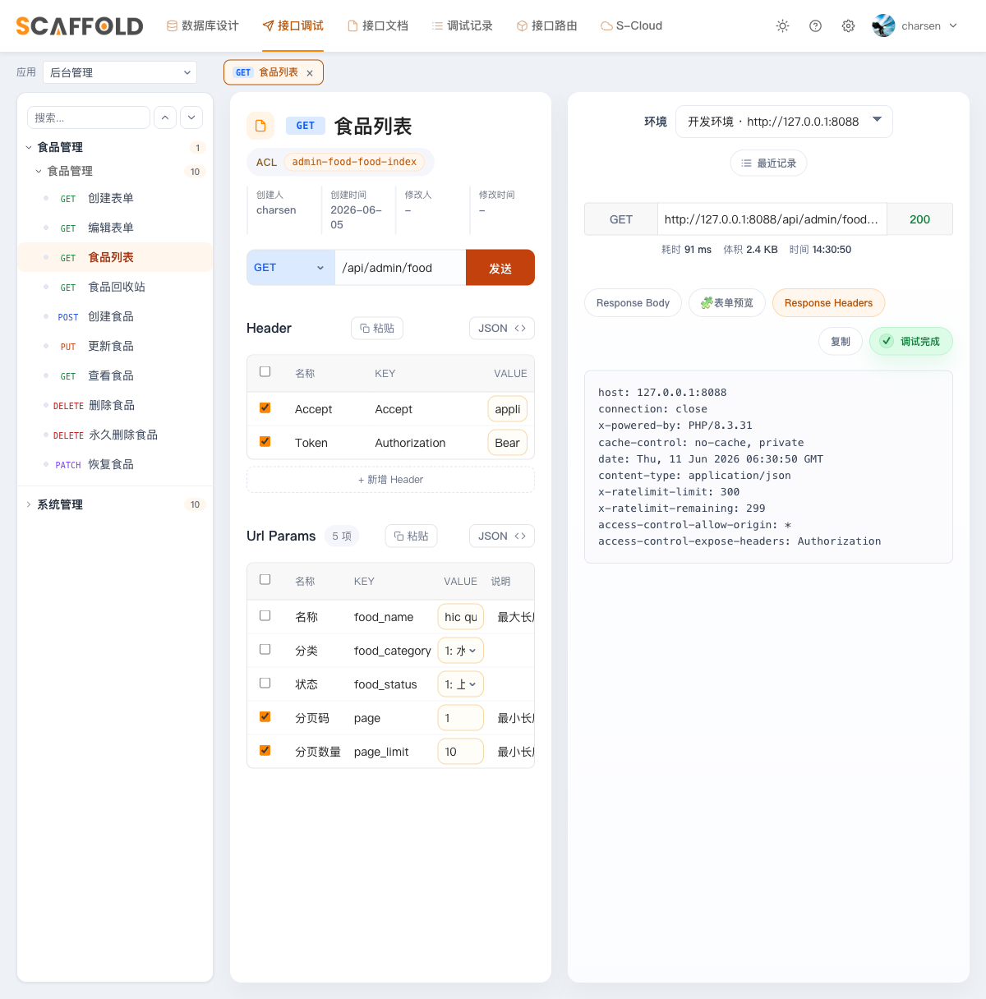

# 第 5 章　JWT 加固与生产化

目标：第 3 章的 JWT 是"能跑"的最小版。这一章把它加固到"能上生产"：
改好 2 个配置文件、给登录和刷新补上安全细节、加上限流和操作日志、
准备好生产用的 composer 文件，最后写第一批接口测试守住这一切。

> 本章的每一处改动，都对应 wisdomcity（上游真实项目）在生产里踩过的坑。
> 跟着做就好，每一步只需要知道"改什么 + 为什么"各一句话。

---

## 5.1 加固 `config/jwt.php`（5 处）

打开 `engine/config/jwt.php`，逐处核对（完整文件见仓库，注释已全部中文化）：

**① 续签时保留 guard 声明** —— 不配它，换发的新 token 会丢掉 `guard`，
下次请求过 `JWTGuardAuth` 直接 401（坑 #10，生产偶发 401 的真因）：

```php
'persistent_claims' => [
    'guard',
],
```

**② 黑名单宽限期 90 秒** —— 页面并发请求时，第一个触发续签后旧 token 立刻进黑名单，
没有宽限期同批在途请求会全部 401（坑 #11）：

```php
'blacklist_grace_period' => 90,
```

**③ 滑动续期** —— 包默认续期窗口永远从首次登录起算，天天在用也会在第 14 天被踢：

```php
'refresh_iat' => true,   // 每次续签把起算点拨到当下
```

**④ 有效期默认值固化进 config** —— `.env` 里没有 `JWT_TTL` 时，包默认只有 60 分钟。
把团队约定写死进 config，env 只留真正逐环境变化的 `JWT_SECRET`：

```php
'ttl'         => (int) env('JWT_TTL', 2880),           // 2 天
'refresh_ttl' => (int) env('JWT_REFRESH_TTL', 20160),  // 14 天
```

**⑤ 黑名单异常开关显式写上** —— 名字像日志开关，实际控制"已拉黑的 token 是否被拒"。
包的代码级默认是关，全靠包内配置回填才是开，这里显式写死不赌运气：

```php
'show_black_list_exception' => true,
```

## 5.2 新建 `config/cors.php`

无感续签的新 token 放在 `authorization` **响应头**里。CORS 默认不暴露任何响应头，
跨域场景（H5 / 前后端分离调试）下浏览器拿不到新 token，旧 token 出宽限期就 401（坑 #12）。

新建 `engine/config/cors.php`（Laravel 12 的 HandleCors 默认就在全局中间件里，发布配置即生效）：

```php
'paths' => ['api/*', 'app/*'],
'exposed_headers' => ['Authorization'],   // 关键行
```

其余键照抄 Laravel 默认即可（完整文件见仓库）。

## 5.3 登录补账号状态检查

第 3 章的登录只校验了密码——被**禁用/锁定**的人员照样能登录。
在 `app/Admin/Controllers/AuthController.php` 的 `Hash::check` 之后补两段：

```php
if ($user->account_status === AccountStatus::FORBIDDEN->value) {
    throw ValidationException::withMessages(['account' => ['帐号已被禁止登录。']]);
}
if ($user->account_status === AccountStatus::LOCKED->value) {
    throw ValidationException::withMessages(['account' => ['帐号已被锁定，请联系管理员。']]);
}
```

> ⚠️ **必须写 `->value`**（坑 #19）：本生态约定枚举不进 `$casts`，`account_status`
> 是裸 int。写成 `=== AccountStatus::FORBIDDEN`（枚举实例）永远为 false，
> 检查等于没写——wisdomcity 的同款检查就这样静默失效了很久。

## 5.4 `/refresh` 路由单独挂中间件

第 3 章把 `refresh` 放进了 `jwt.auth.refresh` 那个组——**要移出来**（坑 #18）：
那个中间件会对过期 token 先自动续签一次（新 token 放响应头），控制器再续签第二次
（放响应体），一个旧 token 就派生出两个有效新 token，响应头那个永远不会作废。

改 `routes/admin.php`：

```php
// 主动刷新：只校验 guard claim，不挂 jwt.auth.refresh
Route::post('refresh', [AuthController::class, 'refresh'])
    ->middleware('jwt.guard.auth:admin')->name('refresh');

// 需要登录（JWT 强制认证 + 近过期续签）
Route::group(['middleware' => ['jwt.guard.auth:admin', 'jwt.auth.refresh']], function () {
    Route::get('me/info', [AuthController::class, 'me'])->name('me.info');
});
```

控制器里 `refresh()` 对应改成"自己处理异常 + 同步登录记录"：

```php
// use PHPOpenSourceSaver\JWTAuth\Exceptions\JWTException;
// use Symfony\Component\HttpKernel\Exception\UnauthorizedHttpException;
// use Mooeen\System\Jobs\UpdateLoginTokenJob;
public function refresh(Request $request): JsonResponse
{
    try {
        // forceForever=false：旧 token 走 90 秒宽限；resetClaims=false：保留 guard
        $token = Auth::guard('admin')->refresh(false, false);
    } catch (JWTException $e) {
        // 无 token / 伪造 / 超出续期窗口 / 已拉黑 → 重新登录
        throw new UnauthorizedHttpException('jwt-auth', $e->getMessage());
    }

    if (! empty($request->bearerToken())) {
        UpdateLoginTokenJob::dispatch($request->bearerToken(), $token);
    }

    return response()->json(['data' => [
        'token' => $token,
        'expires_in' => Auth::guard('admin')->factory()->getTTL() * 60,
    ]]);
}
```

> refresh 本身就接受"过期但在续期窗口内"的 token，不需要前置强制认证。

## 5.5 异常采集与节流（`bootstrap/app.php`）

在 `withExceptions()` 里补三段（完整文件见仓库 `engine/bootstrap/app.php`）：

```php
// use Illuminate\Cache\RateLimiting\Limit;
// use Mooeen\Scaffold\Support\ExceptionDispatcher;

// 第 3 章写过的 dontReport(...) 前面串上 dontReportDuplicates()：同一异常只报一次
$exceptions->dontReportDuplicates()->dontReport([
    JWTException::class,
    NotFoundHttpException::class,
    BaseException::class,
]);

// 一行接入 moo-scaffold 的运行时异常采集（落盘 storage/scaffold/runtimes，/scaffold 可看）
$exceptions->reportable(function (Throwable $e): void {
    app(ExceptionDispatcher::class)->dispatch($e);
});

// 高频 5xx 时别把关键日志吞了
$exceptions->throttle(fn (Throwable $e) => Limit::perMinute(1000));
```

## 5.6 接口限流

`AppServiceProvider::boot()` 里先定义，再挂进中间件组：

```php
RateLimiter::for('admin', fn (Request $r) => Limit::perMinute(300)->by($r->user()?->id ?: $r->ip()));
RateLimiter::for('client', fn (Request $r) => Limit::perMinute(1000)->by($r->user()?->id ?: $r->ip()));
```

`admin` / `moo-system` 组加一行 `'throttle:admin'`，`client` 组加 `'throttle:client'`。

验证：随便调一个 admin 接口，响应头出现 `X-RateLimit-Limit: 300` 即生效。
在 scaffold 调试器的 Response Headers 标签里能同时看到限流头和 5.2 节的 CORS 暴露头：



## 5.7 操作日志中间件

moo-system 提供了 `system_operation_logs` 表和写库的 Job，但**什么时候记、记什么**
由 host 决定。新建 `app/Http/Middleware/OperationLog.php`（完整代码见仓库），要点：

- 用 `terminate()`（响应发出后才执行，不拖慢请求）；
- 密码 / token 等敏感入参替换成 `[FILTERED]`；
- 失败响应的 body 截断到 6 万字符再入库——`response_content` 是 64KB 的 text 列，
  调试模式下一个 5xx 带全量堆栈轻松超限，会让 insert 直接失败；
- 开关在 `config/logging.php`：`'operation' => env('OPERATION_LOG', false)`。

写好后挂到 `admin` 和 `moo-system` 两个组的末尾。

> ⚠️ **最隐蔽的坑（#21）：日志静默不落库**。操作日志走队列 Job——你手上的 `.env`
> 多半还是 Laravel 默认的 `QUEUE_CONNECTION=database`，Job 会全部堆进 `jobs` 表
> 没人消费，表里永远 0 条、又看不到任何报错。**把自己的 `.env` 改成
> `QUEUE_CONNECTION=sync`**（或起 queue worker）。另外：改完 `.env` 要**彻底重启**
> 多 worker 服务——`kill` 父进程后 `php -S` 的 worker 还活着、拿着旧环境变量，
> 要把它们一起杀掉再重启。

> ⚠️ 坑 #13：别照抄老项目里的 `LARAVEL_START` 常量算耗时——Laravel 12 入口文件
> 已经没有它了，用 `$request->server('REQUEST_TIME_FLOAT')`。

## 5.8 `.env.example` 与生产 composer

- 把 `.env.example` 改成"复制即可用"：预填 MariaDB `moo_skeleton`、8088 端口、
  分组中文注释，补 `JWT_SECRET` / `SCAFFOLD_AUTHOR` / `OPERATION_LOG` 占位，
  删掉骨架用不到的 MAIL/AWS 等死键（完整文件见仓库）；
- 新建 `composer.production.json`：moo 包换成 `^3.0` / `^1.2` + Gitee VCS 仓库。
  部署时 `cp composer.production.json composer.json && composer install --no-dev`，
  和第 2 章讲的"开发 path / 生产 vcs"双轨制闭环。

## 5.9 第一批接口测试

两个文件，**完整代码都在仓库里，直接抄**：

- `engine/tests/TestCase.php` —— 公共辅助（登录拿 token、模拟跨进程、手工造过期 token）；
- `engine/tests/Feature/AuthTest.php` —— 9 个用例守住整条链路；
- 顺手给 `engine/phpunit.xml` 加一行测试专用密钥（测试跑在 sqlite 内存库上，
  不读你的 `.env`）：`<env name="JWT_SECRET" value="testing-secret-do-not-use-in-production"/>`

AuthTest 覆盖：
  登录成功 / 错密码 422 / 禁用账号 422 / 无 token 401 / 带 token 200 /
  续签后新 token 可用 / 过期 token 续签只产生一个新 token / 垃圾 token 401 / 登出即拉黑。

```bash
php artisan test
# Tests: 11 passed   ← 本章时间点：AuthTest 9 个 + Laravel 自带 Example 2 个
#（第 6、7 章各再加 5 个，全部做完是 21 passed）
```

> ⚠️ 坑 #14：Feature 测试里两次请求跑在**同一个进程**，jwt 的 payload 工厂是单例，
> 上一次登录残留的 claim 会喂给下一次续签——丢 claim 的 bug 永远测不出来。
> 跨请求断言之间要调 `$this->freshJwtProcess()`（内部 `emptyClaims()`）模拟真实跨进程。

## 5.10 真机验证清单

服务照常起：`PHP_CLI_SERVER_WORKERS=4 php artisan serve --host=127.0.0.1 --port=8088 --no-reload`

| # | 验证 | 期望 |
|---|---|---|
| 1 | 无 token 访问 `me/info` | 401 |
| 2 | 登录 → 带 token 访问 | 200 |
| 3 | `POST /refresh` → 解码新 token | `"guard":"admin"` 在，`exp-iat=172800s` |
| 4 | 用新 token 访问 `me/info` | 200 |
| 5 | 手工构造**已过期** token 访问业务接口 | 200 + 响应头 `authorization: <新token>`（无感续签） |
| 6 | 过期 token 调 `/refresh` | 200，且响应头**没有** authorization（不产生孤儿 token） |
| 7 | 已拉黑的旧 token 90 秒内再用 | 200（宽限期生效） |
| 8 | 登出后再用 | 401（forceForever 不吃宽限） |
| 9 | 带 `Origin` 的跨域请求 | 响应头 `Access-Control-Expose-Headers: Authorization` |
| 10 | 任意 admin 接口 | 响应头 `X-RateLimit-Limit: 300` |
| 11 | 查 `system_operation_logs` 表 | 有记录，含用户归属/响应码/耗时 |
| 12 | `php artisan moo-system check` | 6/6 |

过期 token 没法用 `auth()->login()` 直接造（签完自检就抛异常），手工签一个
`exp` 在过去、`iat` 在续期窗口内的即可——做法见 `tests/TestCase.php` 的
`makeExpiredToken()`，命令行版：

```bash
# 思路：HS256 手工拼 header.payload.signature，claims 带 guard/prv、exp 设在过去。
# 完整可运行实现就在 tests/TestCase.php 的 makeExpiredToken()，照着改成 php -r 即可
SECRET=$(grep "^JWT_SECRET=" .env | cut -d= -f2)
```

## 已知局限（记录在案，不修）

对"已过期但仍在续期窗口内"的 token 调 `logout` 会返回 200 但**没有真正拉黑**
（jwt-auth 的 `logout()` 静默吞掉过期解码异常）。被盗的过期 token 在窗口内无法主动吊销，
只能等窗口关闭或换 `JWT_SECRET` 全员下线。这是 jwt-auth 的设计局限；
敏感场景可在登录管理里把记录置失效 + 缩短 `refresh_ttl` 缓解。

> 进阶小知识（可跳过）：`persistent_claims` 在 jwt-auth **2.8.x** 上不配必丢 guard；
> **2.9.x** 因内部实现"碰巧"保留。不管哪个版本都该配——契约写在文档里，不赌内部实现。

---

## 本章产出

- `config/jwt.php` 5 处加固 + `config/cors.php` 暴露续签响应头；
- 登录有状态检查、`/refresh` 不再产生孤儿 token；
- 限流（admin 300/分钟）+ 操作日志落库（记得 QUEUE_CONNECTION=sync）；
- `.env.example` 复制即可用，`composer.production.json` 部署双轨闭环；
- 11 个接口测试全绿（全部章节完成后是 21 个），12 项真机验证通过。

下一章：把第 2 章故意公开的 `food` 接口锁进 JWT，并启用**动作级 ACL 授权**。
