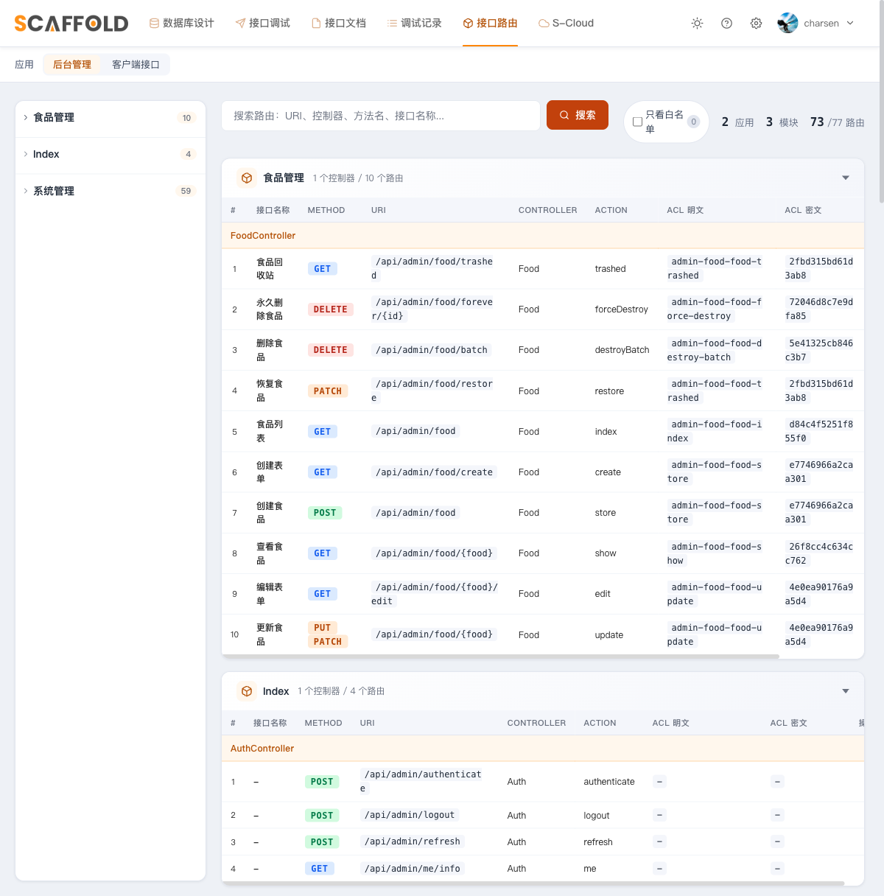

# 第 5 章　给 Food 上 JWT 与 ACL（动作级授权）

目标：把第 2 章故意公开的 `food` 接口锁进 JWT，并启用这套架构的招牌能力——
**动作级 ACL 授权**。做完后完整走一遍：无 token `401` → 有 token 无权限 `403` →
给用户授权 → `200`。

> ACL 的鉴权引擎在 moo-scaffold（免费）里，授权数据怎么存由 host 决定。
> 本章用自建 User 的 `actions` 列做**最小实现**；第 7 章的 moo-system（进阶包）
> 用「角色 → 动作」的完整授权体系实现同一个契约。

---

## 5.1 先花两分钟搞懂机制

moo-scaffold 生成的每个控制器都带这么一段：

```php
public function boot(): void
{
    $this->checkAuthorization();   // 每个 action 执行前先过这里
}
```

`checkAuthorization()` 做两件事：

1. 把「当前控制器::方法」算成一个 **acl key**：先得到明文（如 `admin-food-food-index`），
   再取 `substr(md5(明文), 8, 16)`（如 `d84c4f5251f855f0`）。
   每个接口的明文/密文 key 都能在 `/scaffold/routes` 页面直接看到：

   

2. 拿这个 key 去问 Laravel 的 Gate `acl_authentication`——**这个 Gate 包里不定义，
   必须 host 自己写**（下一节就写它）。

授权数据存在哪？本章的最小实现：第 3 章 User 模型上那个 `actions` JSON 列——
`getActions()` 返回被授权的 key 数组，`'is_root'` 字面量 = 超级权限
（UserSeeder 给 admin@example.com 的就是它）。

## 5.2 启用 ACL（三步）

**第 1 步：写 Gate。** 新建 `app/Providers/AuthServiceProvider.php`（完整文件见仓库，
它是**多态**的——第 7 章换成 Personnel 后一行不用改），核心就是一个判定顺序：

```php
Gate::define('acl_authentication', function ($user, $acl_key) {
    if ($user->isRoot()) return true;                         // ① 天然 root（自增/雪花体系下都不启用）
    // ② config/actions.php 白名单：登录即可用（host 现在还没这个文件也没关系——
    //    config() 拿不到就视为空白名单；第 7 章才需要建它放行个人中心）
    // ③ getActions() 里有 'is_root' 字面量 = 超级权限
    // ④ 精确匹配 acl key
});
```

别忘了在 `bootstrap/providers.php` 登记这个 Provider。

**第 2 步：打开开关。** `config/scaffold.php`：

```php
'authorization' => [
    'check' => true,   // 第 1~4 章一直是 false（全放行）
```

**第 3 步：food 路由入组。** `routes/admin.php` 里把 food 那个空 group 改成：

```php
Route::group(['middleware' => ['jwt.guard.auth:admin', 'jwt.auth.refresh']], function () {
    Route::iResource('food', FoodController::class);
    // :insert_code_here:do_not_delete
});
```

> 从此第 2 章"无 token 调 food"的玩法失效，调试器/curl 都要带 `Bearer token`
> （第 2 章已加注记）。admin@example.com 有 `is_root`，不会把自己锁在门外。

## 5.3 真机演练：403 → 授权 → 200

先造一个**零授权**的用户（tinker）：

```php
$e = App\Models\User::firstOrNew(['email' => 'editor@example.com']);
$e->name = '编辑小王'; $e->password = 'editor888';
$e->email_verified_at = now();   // 过第 4 章的激活检查
$e->save();                       // actions 不给 —— 零授权
```

**① 无 token → 401：**

```bash
curl -s -o /dev/null -w "%{http_code}\n" "http://127.0.0.1:8088/api/admin/food?page=1&page_limit=10"
# 401
```

**② 管理员（is_root）→ 200**；**编辑小王 → 403**（按第 3 章方式分别登录拿 token）：

```bash
curl -s -o /dev/null -w "%{http_code}\n" "http://127.0.0.1:8088/api/admin/food?page=1&page_limit=10" \
  -H "Authorization: Bearer $ADMIN_TOKEN"     # 200
curl -s "http://127.0.0.1:8088/api/admin/food?page=1&page_limit=10" \
  -H "Authorization: Bearer $EDITOR_TOKEN"    # 403 This action is unauthorized.
```

> 调试模式（APP_DEBUG=true）下 403 会带很长的堆栈，生产是干净的 `{"message": ...}`。

**③ 给编辑小王授 `food.index` 这一个动作**（tinker）：

```php
$key = substr(md5(Mooeen\Scaffold\Foundation\Controller::aclPlainKey(
    App\Admin\Controllers\Food\FoodController::class.'::index')), 8, 16);   // d84c4f5251f855f0
$e = App\Models\User::where('email', 'editor@example.com')->first();
$e->actions = [$key]; $e->save();
```

**④ 再测——授权是动作粒度的：**

```bash
# 编辑小王调列表  → 200（刚授的 index）
# 编辑小王新增    → 仍然 403（没授 store）
```

## 5.4 两个容易误判的点

1. **先 422 后 403**（坑 #16）：表单校验发生在控制器 `boot()` 之前。参数不合法时
   你会先看到 422——别误以为"ACL 没生效"，把 `page`/`page_limit` 等必填参数带齐
   才能看到 403。
2. **白名单/授权改完不生效？** 跑过 `config:cache` 的话先 `php artisan config:clear`。

## 5.5 测试守护（练习）

照第 4 章 AuthTest 的样子，给 ACL 写 4 个用例：无 token 401 / is_root 200 /
零授权 403 / 授单个动作后 index 200 而 store 仍 403。
参考答案：仓库 `tests/Feature/FoodAclTest.php`（📦 那是第 7 章接入 moo-system 后的
最终版——授权对象是"角色"而不是用户的 actions 列，思路完全一致）。

---

## 本章产出

- Gate `acl_authentication` 落在 host（包只消费不定义，且多态——换主体不用改）；
- ACL 开关打开，food 接口锁进 JWT；
- 用 User 的 `actions` 列演示了最小授权存储：401 → 403 → 授权 → 200 全链路真机走通。

下一章：启用一直空着的移动端 `Api/` 分片，用 **user 守卫**做真正的双向隔离。
