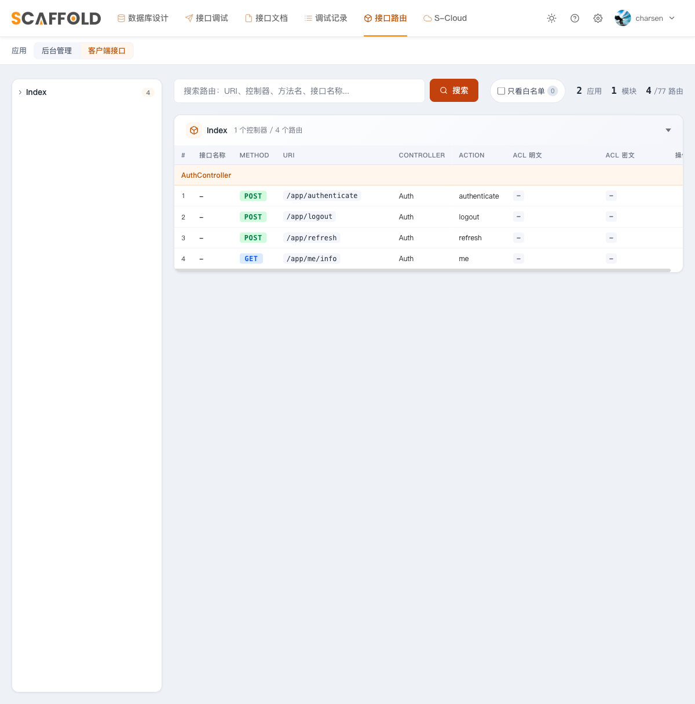

# 第 6 章　移动端分片与 user 守卫

目标：启用 `app/Mobi/` 分片，让移动端使用 user 守卫，并验证 token 双向隔离和严格轮换。

> 移动端的主体就是第 3 章自建的 User——它**永久**属于移动端，
> 第 7 章接入 moo-system 后只有后台换 Personnel，这边一行不动。

---

## 6.1 地基早就铺好了

第 3 章接线时这些已经就位，本章只是用起来：

- `config/auth.php`：`user` 守卫（jwt + users provider）；
- `client` 中间件组：`jwt.assign.guard:user` + 限流，挂在 `app` 前缀上；
- `jwt.guard.auth:user`：校验 token 里的 guard 声明必须是 `user`；
- User 的 `getJWTCustomClaims()` 动态返回当前守卫——经 client 组签发的 token
  天然带 `guard=user`，**不需要任何额外处理**。

## 6.2 写移动端登录控制器

新建 `app/Mobi/Controllers/AuthController.php`，使用下面的完整内容：

```php
<?php

declare(strict_types=1);

namespace App\Mobi\Controllers;

use App\Models\User;
use Illuminate\Http\JsonResponse;
use Illuminate\Http\Request;
use Illuminate\Support\Facades\Auth;
use Illuminate\Support\Facades\Hash;
use Illuminate\Validation\ValidationException;
use PHPOpenSourceSaver\JWTAuth\Exceptions\JWTException;
use Symfony\Component\HttpKernel\Exception\UnauthorizedHttpException;

class AuthController
{
    public function authenticate(Request $request): JsonResponse
    {
        $params = $request->validate([
            'email' => ['required', 'email'],
            'password' => ['required', 'string'],
        ]);

        $user = User::where('email', $params['email'])->first();

        if ($user === null || ! Hash::check($params['password'], (string) $user->password)) {
            throw ValidationException::withMessages(['email' => ['帐号或密码错误。']]);
        }

        if ($user->email_verified_at === null) {
            throw ValidationException::withMessages(['email' => ['帐号尚未激活（邮箱未验证）。']]);
        }

        $token = Auth::guard('user')->login($user);

        return response()->json(['data' => [
            'user' => ['id' => $user->id, 'name' => $user->name, 'email' => $user->email],
            'token' => $token,
            'expires_in' => Auth::guard('user')->factory()->getTTL() * 60,
        ]]);
    }

    public function me(): JsonResponse
    {
        $user = Auth::guard('user')->user();

        return response()->json(['data' => ['user' => [
            'id' => $user->id,
            'name' => $user->name,
            'email' => $user->email,
        ]]]);
    }

    public function refresh(): JsonResponse
    {
        try {
            $token = Auth::guard('user')->refresh(true, false);
        } catch (JWTException $e) {
            throw new UnauthorizedHttpException('jwt-auth', $e->getMessage());
        }

        return response()->json(['data' => [
            'token' => $token,
            'expires_in' => Auth::guard('user')->factory()->getTTL() * 60,
        ]]);
    }

    public function logout(): JsonResponse
    {
        Auth::guard('user')->logout(true);

        return response()->json(['message' => 'ok']);
    }
}
```

先做语法与类加载检查：

```bash
php -l app/Mobi/Controllers/AuthController.php
php artisan tinker --execute="var_dump(class_exists(App\\Api\\Controllers\\AuthController::class));"
# bool(true)
```

骨架仍是熟悉的「查用户 → `Hash::check` → 签发」。现在再理解它与后台版的**三个差异**：

**① 主体是自建 User，用 email 登录** —— 不依赖 moo-system；guard claim 由
`User::getJWTCustomClaims()` 动态注入（client 组已 `shouldUse('user')`），无需任何内联覆盖。

**② 刷新用无宽限严格轮换：**

```php
$token = Auth::guard('user')->refresh(true, false);
```

两个参数**都不能随手改**：

- 第一个 `forceForever = true`：这次拿来刷新的旧 token 直接**永久**进黑名单。
  > 「90 秒宽限」指 `config/jwt.php` 的 `blacklist_grace_period = 90`（第 4 章配的）：
  > 续签后旧 token 还能再用 90 秒，护住页面并发的在途请求。
  > 一句话记忆：**后台怕并发打架要宽限（传 `false`）；移动端刷新采用严格轮换，不留宽限（传 `true`）。**
  > 这只能保证“一个旧 token 不能重复刷新/继续使用”，**不是完整的单设备登录**：
  > 同一用户在另一台设备重新登录得到的其它 token 不会被自动吊销。真要实现跨设备互踢，
  > 还需要服务端会话表或 `token_version` / 设备会话 ID，并在每次认证时校验。
- 第二个 `resetClaims = false`：续签时**保留** token 里的自定义声明。它配合第 4 章的
  `persistent_claims = ['guard']` 契约（见 `config/jwt.php`）保住 `guard` 声明——
  改成 `true` 的话，续签出的新 token 会丢 `guard`，下一个请求就过不了 `JWTGuardAuth`。

**③ 登录状态位仍使用 User 的邮箱验证时间**：`email_verified_at` 为空直接 422 拒登。
第 4 章已经给当前后台 User 登录补了同样检查；第 7 章后台换成 Personnel 后，
后台状态位改为 `account_status` 枚举，而移动端继续使用 `email_verified_at`。

登出与后台**完全相同**（不算差异）：`Auth::guard('user')->logout(true);` 永久拉黑当前 token。
refresh 的 try/catch 写法也与第 4 章的后台版相同。

## 6.3 路由（`routes/mobi.php`）

把 `routes/mobi.php` 完整整理成下面这样。这里把 `declare`、控制器 import 和第 3 章已有的
hello 路由一起列出，避免只复制中间片段后出现 `Class "AuthController" not found`：

```php
<?php

declare(strict_types=1);

use App\Mobi\Controllers\AuthController;
use Illuminate\Support\Facades\Route;

Route::get('/', static fn () => 'Hello app api ~');

// 公开：登录 / 退出。登录单独限流（账号 + IP，5 次/分钟防爆破）——
// throttle:login 限流器第 4 章已在 AppServiceProvider 里定义好，这里只管挂
Route::post('authenticate', [AuthController::class, 'authenticate'])
    ->middleware('throttle:login')->name('authenticate');
Route::post('logout', [AuthController::class, 'logout'])->name('logout');

// 主动刷新：单独挂 guard 校验，不进 jwt.auth.refresh —— 否则过期 token 会被中间件
// 和控制器各续签一次，凭一个旧 token 派生出两个有效新 token（孤儿 token，详见第 4.4 节）
Route::post('refresh', [AuthController::class, 'refresh'])
    ->middleware('jwt.guard.auth:user')->name('refresh');

Route::group(['middleware' => ['jwt.guard.auth:user', 'jwt.auth.refresh']], function () {
    Route::get('me/info', [AuthController::class, 'me'])->name('me.info');

    // :insert_code_here:do_not_delete
});
```

先让 Laravel 展开真实中间件链：

```bash
php artisan route:list --path=app -v
# authenticate 有 client + throttle:login
# refresh 有 client + JWTGuardAuth:user
# me/info 有 client + JWTGuardAuth:user + JWTAuthOrRefresh
```

> 最后那行魔法注释是 **moo-scaffold 生成器的插入锚点**（仓库 `engine/routes/mobi.php`
> 顶部注释写明「供 moo-scaffold 生成器插入路由，勿删」）：第 9 章增量开发时，
> 生成器会把新模块的 `iResource` 路由自动写到这个位置——默认就落在保护圈里。
> 删了它不影响运行，但生成器会找不到插入点。

写好后在 `/scaffold/routes` 切到「移动端接口」应用，能看到移动端路由：



> 截图来自完成态，因此会多出第 9 章生成的 food 路由。本章只需看到
> 登录、退出、刷新和 me。`/app`
> 的 hello 是闭包路由，Laravel 的 `route:list` 中存在、浏览器也能访问，但 Scaffold
> 这个按控制器整理的路由页不会展示它。可以再执行
> `curl http://127.0.0.1:8088/app`，应输出 `Hello app api ~`。

> 此时切到 Scaffold 的「接口调试」页，「移动端接口」左侧会是空的：调试器只读
> `scaffold/api/mobi/` 里已生成的接口元数据，本章手写的 AuthController 还没有这份元数据。
> 这不影响路由和业务代码，下一节用 `curl` 真实调用；第 9 章由生成器产出的 Food
> 移动端接口会正常出现在调试器中。

## 6.4 真机验证

前置两件事：① 开发服务器跑在 **8088 端口**（第 1 章的约定端口，否则下面的 curl 全是
connection refused）；② `UserSeeder` 已执行——本章控制器多了激活检查，
`admin@example.com` 的 `email_verified_at` 必须非空，否则登录直接 422「帐号尚未激活」
（seeder 里填的是 `now()`，没动过就没事）。

```bash
BASE=http://127.0.0.1:8088

# ① 分别登录移动端和后台。函数会显示响应正文、HTTP 状态，并验证 data.token。
login_token() {
  LOGIN_LABEL=$1
  LOGIN_URL=$2
  LOGIN_JSON=$3
  LOGIN_TOKEN=

  if ! LOGIN_RESULT=$(curl -sS -w '\n%{http_code}' -X POST "$LOGIN_URL" \
    -H 'Content-Type: application/json' -d "$LOGIN_JSON"); then
    printf '[%s] 请求发送失败：请确认服务和 8088 端口。\n' "$LOGIN_LABEL" >&2
    return 1
  fi

  LOGIN_STATUS=${LOGIN_RESULT##*$'\n'}
  LOGIN_BODY=${LOGIN_RESULT%$'\n'*}
  printf '\n[%s 登录响应]\n%s\nHTTP %s\n' "$LOGIN_LABEL" "$LOGIN_BODY" "$LOGIN_STATUS"

  if [ "$LOGIN_STATUS" != 200 ]; then
    printf '[%s] 登录失败：根据上面的 message / errors 排查。\n' "$LOGIN_LABEL" >&2
    return 1
  fi

  LOGIN_TOKEN=$(printf '%s' "$LOGIN_BODY" | php -r '
    $json = json_decode(stream_get_contents(STDIN), true);
    echo is_string($json["data"]["token"] ?? null) ? $json["data"]["token"] : "";
  ')

  if [ -z "$LOGIN_TOKEN" ]; then
    printf '[%s] 响应中没有 data.token，请检查 AuthController。\n' "$LOGIN_LABEL" >&2
    return 1
  fi

  printf '[%s] 已拿到 token（长度 %s）。\n' "$LOGIN_LABEL" "${#LOGIN_TOKEN}"
}

# 移动端前缀是 app；后台前缀是 api/admin。
login_token '移动端' "$BASE/app/authenticate" \
  '{"email":"admin@example.com","password":"password"}' && APP_TOKEN=$LOGIN_TOKEN
login_token '后台' "$BASE/api/admin/authenticate" \
  '{"email":"admin@example.com","password":"password"}' && ADMIN_TOKEN=$LOGIN_TOKEN

if [ -z "${APP_TOKEN:-}" ] || [ -z "${ADMIN_TOKEN:-}" ]; then
  echo '至少一个守卫没有拿到 token，请先解决上面的登录错误，不要继续验证隔离。' >&2
else
  # ② 解码移动端 token 的 payload，并明确验证 guard=user。
  # 使用项目已有的 PHP 解 base64url，避免 macOS/Linux 的 base64 参数差异。
  printf '%s' "$APP_TOKEN" | php -r '
    $token = stream_get_contents(STDIN);
    $parts = explode(".", $token);
    if (count($parts) !== 3) {
        fwrite(STDERR, "JWT 格式错误：应当有三个点分段。\n");
        exit(1);
    }
    $payload = strtr($parts[1], "-_", "+/");
    $payload .= str_repeat("=", (4 - strlen($payload) % 4) % 4);
    $json = json_decode((string) base64_decode($payload, true), true);
    if (! is_array($json)) {
        fwrite(STDERR, "JWT payload 不是有效 JSON。\n");
        exit(1);
    }
    echo json_encode($json, JSON_UNESCAPED_UNICODE | JSON_PRETTY_PRINT), PHP_EOL;
    if (($json["guard"] ?? null) !== "user") {
        fwrite(STDERR, "guard 校验失败：移动端 token 应为 user。\n");
        exit(1);
    }
  '

  # ③ 各回各家 → HTTP 200。保留正文，能看出实际认证成了谁。
  curl -sS "$BASE/app/me/info" \
    -H "Authorization: Bearer $APP_TOKEN" -w '\nHTTP %{http_code}\n'
  curl -sS "$BASE/api/admin/me/info" \
    -H "Authorization: Bearer $ADMIN_TOKEN" -w '\nHTTP %{http_code}\n'

  # ④ token 交叉使用 → HTTP 401。正文应说明 guard 不匹配。
  curl -sS "$BASE/app/me/info" \
    -H "Authorization: Bearer $ADMIN_TOKEN" -w '\nHTTP %{http_code}\n'
  curl -sS "$BASE/api/admin/me/info" \
    -H "Authorization: Bearer $APP_TOKEN" -w '\nHTTP %{http_code}\n'
fi

# ⑤ 无宽限严格轮换：拿新 token 后，被刷新的旧 token 立即 401。
refresh_app_token() {
  NEW_TOKEN=

  if [ -z "${APP_TOKEN:-}" ]; then
    echo 'APP_TOKEN 为空，不能刷新；请先修复移动端登录。' >&2
    return 1
  fi

  if ! REFRESH_RESULT=$(curl -sS -w '\n%{http_code}' -X POST "$BASE/app/refresh" \
    -H "Authorization: Bearer $APP_TOKEN"); then
    echo '刷新请求发送失败：请确认服务仍在运行。' >&2
    return 1
  fi

  REFRESH_STATUS=${REFRESH_RESULT##*$'\n'}
  REFRESH_BODY=${REFRESH_RESULT%$'\n'*}
  printf '\n[移动端刷新响应]\n%s\nHTTP %s\n' "$REFRESH_BODY" "$REFRESH_STATUS"

  if [ "$REFRESH_STATUS" != 200 ]; then
    echo '刷新失败：根据上面的 message 排查。' >&2
    return 1
  fi

  NEW_TOKEN=$(printf '%s' "$REFRESH_BODY" | php -r '
    $json = json_decode(stream_get_contents(STDIN), true);
    echo is_string($json["data"]["token"] ?? null) ? $json["data"]["token"] : "";
  ')

  if [ -z "$NEW_TOKEN" ]; then
    echo '刷新响应中没有 data.token。' >&2
    return 1
  fi

  printf '已拿到新 token（长度 %s）。\n' "${#NEW_TOKEN}"
}

if refresh_app_token; then
  curl -sS "$BASE/app/me/info" \
    -H "Authorization: Bearer $NEW_TOKEN" -w '\nHTTP %{http_code}\n' # HTTP 200
  curl -sS "$BASE/app/me/info" \
    -H "Authorization: Bearer $APP_TOKEN" -w '\nHTTP %{http_code}\n' # HTTP 401
fi
```

结果不符合预期时，按响应状态和正文定位：

| 现象 | 优先检查 |
|---|---|
| `/app/authenticate` 是 `HTTP 404` | `bootstrap/app.php` 是否把 `routes/mobi.php` 挂到 `app` 前缀 |
| 登录是 `HTTP 422`「帐号尚未激活」 | `email_verified_at` 是否为空；重新执行或核对 UserSeeder |
| 登录是 `HTTP 500`，控制器类不存在 | `routes/mobi.php` 是否导入 `App\Mobi\Controllers\AuthController` |
| 移动端 token 的 guard 不是 `user` | `client` 组是否挂了 `jwt.assign.guard:user`，User 是否动态返回当前 guard |
| token 交叉使用仍是 `HTTP 200` | `me/info` 是否挂了对应的 `jwt.guard.auth:user/admin` |
| 刷新后的新 token 返回 `Guard Unverified` | `refresh(true, false)` 的第二个参数及 `persistent_claims=['guard']` 是否正确 |
| 刷新后旧 token 仍是 `HTTP 200` | 第一个参数是否为 `true`、JWT 黑名单是否开启，以及是否清过业务缓存 |

> 完成第 7 章后，后台登录参数要改为
> `{"account":"13800000000","password":"admin888"}`；移动端仍使用 email。

最后把上面的手工验证固化成测试。不要直接抄仓库最终态的 `tests/TestCase.php`：
那个文件已经进入第 7 章，会引用你此刻还没安装的 `Personnel`。本章时点请把
`tests/TestCase.php` 完整整理成下面这份可直接运行的 User 版：

```php
<?php

declare(strict_types=1);

namespace Tests;

use App\Models\User;
use Illuminate\Foundation\Testing\TestCase as BaseTestCase;
use Illuminate\Testing\TestResponse;

abstract class TestCase extends BaseTestCase
{
    protected function tokenFromResponse(TestResponse $response, string $context): string
    {
        $response->assertOk()->assertJsonStructure(['data' => ['token']]);

        $token = $response->json('data.token');
        $this->assertIsString($token, "{$context}的 data.token 必须是字符串。");
        $this->assertNotSame('', $token, "{$context}的 data.token 不能为空。");

        return $token;
    }

    protected function adminLogin(): string
    {
        $response = $this->postJson('api/admin/authenticate', [
            'email' => 'admin@example.com',
            'password' => 'password',
        ]);

        return $this->tokenFromResponse($response, '后台登录响应');
    }

    protected function appLogin(): string
    {
        $response = $this->postJson('app/authenticate', [
            'email' => 'admin@example.com',
            'password' => 'password',
        ]);

        return $this->tokenFromResponse($response, '移动端登录响应');
    }

    protected function freshJwtProcess(): void
    {
        foreach ([
            'tymon.jwt', 'tymon.jwt.auth', 'tymon.jwt.manager',
            'tymon.jwt.provider.auth', 'tymon.jwt.payload.factory', 'tymon.jwt.blacklist',
            'auth.driver',
        ] as $id) {
            $this->app->forgetInstance($id);
        }
    }

    protected function makeExpiredToken(string $guard = 'admin'): string
    {
        $user = User::where('email', 'admin@example.com')->firstOrFail();
        $b64 = static fn (string $data): string => rtrim(strtr(base64_encode($data), '+/', '-_'), '=');
        $header = $b64(json_encode(['typ' => 'JWT', 'alg' => 'HS256']));
        $now = time();
        $payload = $b64(json_encode([
            'iss' => 'http://localhost/'.$guard.'/authenticate',
            'iat' => $now - 7200,
            'exp' => $now - 3600,
            'nbf' => $now - 7200,
            'jti' => bin2hex(random_bytes(8)),
            'sub' => (string) $user->id,
            'prv' => sha1(User::class),
            'guard' => $guard,
        ]));
        $signature = $b64(hash_hmac('sha256', "{$header}.{$payload}", (string) config('jwt.secret'), true));

        return "{$header}.{$payload}.{$signature}";
    }
}
```

新建 `tests/Feature/MobiAuthTest.php`：

```php
<?php

declare(strict_types=1);

namespace Tests\Feature;

use Illuminate\Foundation\Testing\RefreshDatabase;
use Tests\TestCase;

class MobiAuthTest extends TestCase
{
    use RefreshDatabase;

    protected $seed = true;

    public function test_app_me_without_token_returns_401(): void
    {
        $this->getJson('app/me/info')->assertUnauthorized();
    }

    public function test_app_login_and_me(): void
    {
        $token = $this->appLogin();

        $this->getJson('app/me/info', ['Authorization' => "Bearer {$token}"])
            ->assertOk()
            ->assertJsonPath('data.user.email', 'admin@example.com');
    }

    public function test_guard_isolation_between_admin_and_user_tokens(): void
    {
        $adminToken = $this->adminLogin();
        $this->freshJwtProcess();
        $appToken = $this->appLogin();
        $this->freshJwtProcess();

        $this->getJson('app/me/info', ['Authorization' => "Bearer {$adminToken}"])
            ->assertUnauthorized();
        $this->freshJwtProcess();

        $this->getJson('api/admin/me/info', ['Authorization' => "Bearer {$appToken}"])
            ->assertUnauthorized();
        $this->freshJwtProcess();

        $this->getJson('app/me/info', ['Authorization' => "Bearer {$appToken}"])->assertOk();
        $this->freshJwtProcess();
        $this->getJson('api/admin/me/info', ['Authorization' => "Bearer {$adminToken}"])->assertOk();
    }

    public function test_app_refresh_strictly_rotates_token(): void
    {
        $token = $this->appLogin();
        $this->freshJwtProcess();

        $response = $this->postJson('app/refresh', [], ['Authorization' => "Bearer {$token}"]);
        $newToken = $this->tokenFromResponse($response, '移动端刷新响应');
        $this->assertNotSame($token, $newToken, '刷新必须签发一枚不同的新 token。');
        $this->freshJwtProcess();

        $this->getJson('app/me/info', ['Authorization' => "Bearer {$newToken}"])->assertOk();
        $this->freshJwtProcess();
        $this->getJson('app/me/info', ['Authorization' => "Bearer {$token}"])->assertUnauthorized();
    }

    public function test_expired_app_token_refresh_yields_one_new_token(): void
    {
        $expired = $this->makeExpiredToken('user');

        $response = $this->postJson('app/refresh', [], ['Authorization' => "Bearer {$expired}"]);
        $response->assertHeaderMissing('authorization');

        $newToken = $this->tokenFromResponse($response, '过期 token 刷新响应');
        $this->freshJwtProcess();
        $this->getJson('app/me/info', ['Authorization' => "Bearer {$newToken}"])->assertOk();
    }
}
```

现在运行本章的 5 个用例，然后再跑一次全量回归：

```bash
php artisan test --filter=MobiAuthTest --stop-on-failure
php artisan test
```

两条命令都应通过。`freshJwtProcess()` 只用于清理测试进程中的 JWT 单例状态。

## 6.5 User 就是你的会员表雏形

真实项目的移动端用户往往要加昵称、头像、第三方 openid、手机验证码登录……
直接在这张 users 表上加列、在这个 User 模型上加方法即可——它从第 3 章起就是
为移动端准备的。后台如果需要完整的组织架构（部门 / 岗位 / 人员 / 角色 / 授权），
那才是下一章 moo-system 的事。

---

## 本章产出

- `Api/` 分片启用：登录 / me / 刷新 / 登出四件套（user 守卫，自建 User，登录挂 `throttle:login` 限流）；
- admin ↔ user token 双向隔离，移动端刷新采用无宽限严格轮换；
- 自动测试和 curl 真机验证通过。

下一章（可选 / 进阶）：接入 **moo-system**，后台升级成完整的系统管理
（部门 / 岗位 / 人员 / 角色 / 授权 / 操作日志）。
