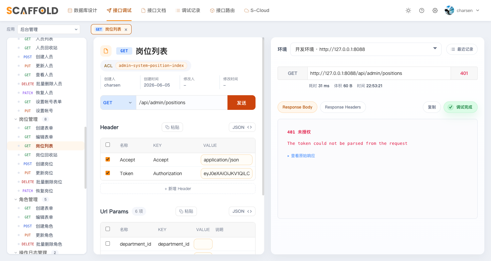
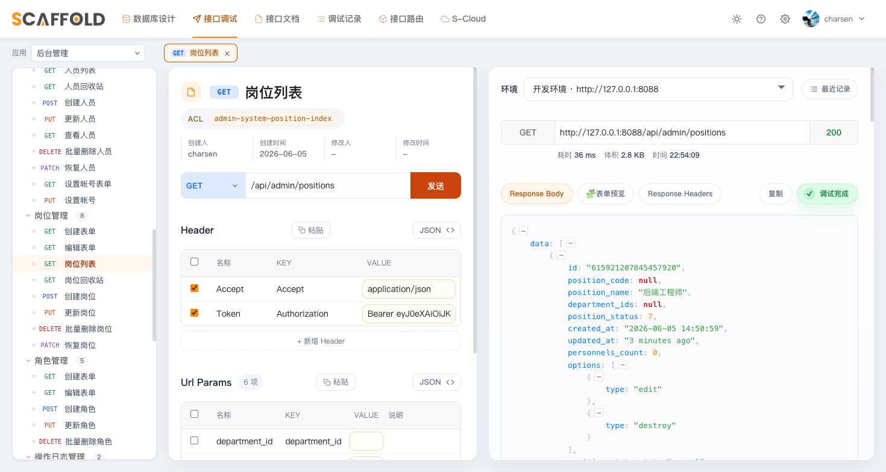

# 第 7 章　安装 moo-system（进阶：完整系统管理）

目标：接入 `charsen/moo-system`，后台一步升级成完整的系统管理：
**部门 / 岗位 / 人员 / 角色 / 授权 / 登录管理 / 操作日志 / 个人中心**。
后台守卫的主体从自建 User 切换为包里的 Personnel——前六章搭的 JWT 骨架一行不用动，
这正是第 3 章埋下的伏笔。

> 📦 moo-system 是**商业包**（proprietary，获取与授权方式联系作者）。
> 没有它，前六章的骨架已是完整可用的"自建用户 + JWT + ACL"后端
> （moo-scaffold 本身是开源的）；装上它，你得到的是一套生产里打磨过的
> 组织架构与授权体系。

---

## 7.1 接入包

把 `system` 仓库加进 `engine/composer.json` 的 `repositories`（第 2 章只声明了 scaffold）：

```json
"require": {
    "charsen/moo-scaffold": "dev-master as 3.999.0",
    "charsen/moo-system": "dev-master as 1.999.0"
},
"repositories": {
    "scaffold": { "type": "path", "url": "../../moo-scaffold" },
    "system":   { "type": "path", "url": "../../moo-system" }
}
```

> composer **不会**读依赖包自带的 repositories 声明——moo-system 依赖 moo-scaffold，
> host 必须把两个仓库都列出来。

安装（会自动带入 kalnoy/nestedset、maatwebsite/excel、jenssegers/agent 等依赖）：

```bash
composer update charsen/moo-system --with-all-dependencies
```

> ⚠️ **坑 #5**：`composer update` 跑到末尾的 `package:discover` 就会报
> `Attribute [iResource] does not exist`——**这是预期的**，不是安装失败。
> moo-system 在它的 ServiceProvider `boot()` 阶段就加载包路由调用了 `Route::iResource`，
> 而宏注册在 `AppServiceProvider::boot()` 里就太晚了（第 2 章埋的雷在这里爆）。
> **把宏挪到 `register()`**（所有 provider 的 `register()` 都先于任何 `boot()`）即可。

## 7.2 提供 host 端契约（5 个文件 + 1 个全局函数）

moo-system 的控制器/模型会 `use` host 侧的几个 trait 和类（叫「host 契约」）。
**5 个成品文件都在本仓库里，直接抄**：

```
engine/app/Admin/Controllers/Traits/BaseActionTrait.php   ← 覆盖第 2 章 scaffold 生成的精简版
engine/app/Admin/Controllers/Traits/UploaderTrait.php
engine/app/Models/Traits/MediaSynchronous.php
engine/app/Models/Notification.php
engine/app/Notifications/SendBlessMessage.php
```

还差一个全局函数 `toLabelValue()`（部门控制器在用）：抄 `engine/app/Helpers/helpers.php`，
并在 `composer.json` 登记 `files` 自动加载后 `composer dump-autoload`：

```json
"autoload": {
    "psr-4": { "App\\": "app/", ... },
    "files": [ "app/Helpers/helpers.php" ]
}
```

> ⚠️ **坑 #6**：不补 `toLabelValue()`，调部门列表会报 `undefined function`（HTTP 500）。

## 7.3 后台主体切换：User → Personnel

这是本章的核心动作，也是第 3 章设计的回报时刻——只动两处：

**① `config/auth.php`**：加 `personnels` provider，`admin` 守卫切过去
（`user` 守卫**不动**，移动端继续用自建 User）：

```php
'guards' => [
    'web'   => ['driver' => 'session', 'provider' => 'users'],
    'admin' => ['driver' => 'jwt', 'provider' => 'personnels', 'hash' => false],   // ← 切换
    'user'  => ['driver' => 'jwt', 'provider' => 'users', 'hash' => false],        // ← 不动
],
'providers' => [
    'users'      => ['driver' => 'eloquent', 'model' => App\Models\User::class],
    'personnels' => ['driver' => 'eloquent', 'model' => Mooeen\System\Models\Personnel::class],
],
```

**② `app/Admin/Controllers/AuthController.php`** 换成 Personnel 版
（**仓库里就是最终版，直接抄**）。与第 3 章 User 版的差异一目了然：

- 查询主体：`Personnel::where('real_name', ...)->orWhere('mobile', ...)`（姓名或手机号登录）；
- 状态检查：`account_status` 枚举——**必须比较 `->value`**（坑 #19）：
  本生态约定枚举不进 `$casts`、字段是裸 int，写 `=== AccountStatus::FORBIDDEN`
  （枚举实例）永远为 false，检查会静默失效；
- 登录后更新 `login_times / last_login_at / last_login_ip`；
- `refresh()` 补一行 `UpdateLoginTokenJob::dispatch($old, $new)`（同步包里的登录管理记录）。

> **历史坑 #17**：moo-system 旧版的 `Personnel::getJWTCustomClaims()` 硬编码
> `guard=admin`，host 给其它守卫签发时必须 `claims(['guard'=>...])` 内联覆盖。
> 新版已动态化（和你第 3 章给 User 写的一样），此坑仅在用旧版包时存在。

## 7.4 包路由接线 + 迁移 + 自检

发布包配置并指到第 3 章预埋的 `moo-system` 中间件组：

```bash
php artisan vendor:publish --tag=moo-system-config
```

```php
// config/moo-system.php
'admin' => ['prefix' => 'api/admin', 'name' => 'admin.', 'middleware' => 'moo-system'],
```

顺手把 moo-system 的控制器登记进 scaffold（`config/scaffold.php`）——
ACL key 的命名空间反查、接口文档、调试器联调都依赖这一步，**必须在跑测试之前做**：

```php
'controller' => [
    'admin' => [
        // ...
        'extra_modules' => [
            'System' => 'Mooeen\\System\\Http\\Controllers\\Admin',
        ],
    ],
],
```

迁移（包内 migration 自动加载）+ 6 项自检：

```bash
php artisan migrate              # 建 system_* 共 10 张表
php artisan moo-system check    # 应 6/6 全绿
```

```
✓ Auth provider 配置真实 FQN
✓ admin middleware group 含 jwt.auth.refresh   ← 靠第 3 章"组注册在 provider boot()"（坑 #7）
✓ Composer classmap 不含已删的 App\Models\System\*   ← 指老项目迁包前的旧类，新项目天然通过
✓ Host 端 5 个必需契约 trait/class 全部存在
✓ Route::iResource macro 已注册
✓ config:cache 与 source 一致
🎉  All 6 required checks passed.
```

## 7.5 初始数据：角色 → 部门 → 岗位 → 人员

4 个 seeder **完整代码见仓库 `engine/database/seeders/`，抄过来**，
并把第 3 章精简过的 `DatabaseSeeder` 换成仓库版（UserSeeder 之后按序调用四个）：

| Seeder | 内容 |
|---|---|
| `RoleSeeder` | 系统管理员（授 `is_root` 字面量 = 超级权限，对应 ACL Gate 第三优先级）/ 开发 / 编辑员 |
| `DepartmentSeeder` | 猫途科技（根）→ 技术部[后端组/前端组] / 市场部（嵌套集树 `_lft/_rgt`） |
| `PositionSeeder` | 后端工程师 / 前端工程师 / 市场专员 |
| `PersonnelSeeder` | 管理员 `13800000000` / `admin888`，挂技术部·后端工程师·系统管理员角色 |

```bash
php artisan db:seed              # 已迁移过的话直接 seed
```

> ⚠️ **坑 #9**：`DatabaseSeeder` 千万**别用** `WithoutModelEvents`——
> Department 的嵌套集树靠 `creating/saving` 模型事件维护 `_lft/_rgt`，
> 静默事件会建出坏树。
>
> ⚠️ **坑 #15**：雪花主键下不存在 id=1 的天然 root。「系统管理员」角色必须授
> `is_root` 字面量（RoleSeeder 已带），否则开着 ACL 的系统里管理员自己也 403。

**ACL 白名单**：开着 ACL 接入 moo-system 后，`config/actions.php` 的 `whitelist`
必须放行**个人中心**的 8 个动作（查看本人信息、改密码、改头像等，key 见仓库该文件
的注释）——否则零授权角色登录后连自己的资料都 403，把自己锁死在门外（坑 #20）。

## 7.6 操作日志

moo-system 提供了 `system_operation_logs` 表和写库 Job，采集点由 host 决定。
抄仓库的 `app/Http/Middleware/OperationLog.php`（terminable、敏感参数 `[FILTERED]`、
响应截断 6 万字符），挂到 `admin` / `moo-system` 两个组的**末尾**，
开关在 `config/logging.php`：`'operation' => env('OPERATION_LOG', false)`。

> ⚠️ **坑 #13**：别照抄老项目的 `LARAVEL_START` 常量算耗时——Laravel 12 没有它了，
> 用 `$request->server('REQUEST_TIME_FLOAT')`。
>
> ⚠️ **坑 #21（最隐蔽）**：日志表永远 0 条、又无报错？你手上的 `.env` 多半还是
> `QUEUE_CONNECTION=database`，Job 全堆在 `jobs` 表没人消费。改成 `sync`（或起
> queue worker），并且**改完 `.env` 要把 `php -S` 的 worker 一起杀掉重启**。

## 7.7 测试三件套换最终版

第 4 章手写的 User 版 AuthTest 完成了历史使命——换成仓库的最终版三件套
（`tests/TestCase.php` + `AuthTest`（Personnel 版）+ `FoodAclTest`（角色版）+
`ApiAuthTest`（User 版，不用动），含 phpunit.xml 那行密钥）。仓库里另有两个
守护测试：`JwtAutoRefreshTest`（中间件对过期 token 的静默续签——挂
`jwt.auth.refresh` 的路由收到过期 token 应 200 并经 `authorization` 响应头下发新
token）和 `SeederIntegrityTest`（部门嵌套集树完整性、岗位 JSON 关联等 seeder 回归）：

```bash
php artisan test
# Tests: 27 passed
```

`FoodAclTest` 演示的正是授权存储的升级：第 5 章给 User 的 `actions` 列授 key，
现在给「角色」授 key（`$role->role_actions = [...]`），人挂角色——Gate 一行没改。

## 7.8 在 scaffold 调试器里联调

7.4 已把控制器登记进 scaffold（extra_modules），现在生成接口文档、刷新调试器：

```bash
php artisan moo:api admin System
```

左侧多出「系统管理」整组（部门 / 岗位 / 人员 / 角色 / 授权 / 通知机器人 / 登录 / 操作日志 / 个人信息）：



登录拿 token（注意主体已是 Personnel：`{"account":"13800000000","password":"admin888"}`），
点开「岗位管理 → 岗位列表」，在 Header 区把 **Authorization 填成 `Bearer <token>`**
（坑 #8：一定要带 `Bearer ` 前缀，否则报 `The token could not be parsed`），发送拿 200：



再用 curl 走一遍 CRUD（岗位名换个 seeder 里没有的，重名会撞唯一校验 422）：

```bash
TOKEN=$(curl -s -X POST http://127.0.0.1:8088/api/admin/authenticate \
  -H "Content-Type: application/json" \
  -d '{"account":"13800000000","password":"admin888"}' \
  | sed -n 's/.*"token":"\([^"]*\)".*/\1/p')

curl -s "http://127.0.0.1:8088/api/admin/departments?page=1&page_limit=10" \
  -H "Accept: application/json" -H "Authorization: Bearer $TOKEN"      # 部门树

curl -s -X POST http://127.0.0.1:8088/api/admin/positions \
  -H "Content-Type: application/json" -H "Authorization: Bearer $TOKEN" \
  -d '{"position_name":"测试工程师"}'                                   # 201
```

---

## 本章产出

- moo-system 接入：10 张 `system_*` 表、`moo-system check` 6/6；
- 后台主体 User → Personnel **只改了两处**（auth.php 一行 + 控制器一个文件），
  中间件 / 路由 / Gate / 移动端零改动——这就是第 3 章骨架设计的价值；
- 角色制授权接管 ACL（白名单放行个人中心），操作日志落库；
- 测试三件套最终版 21 个全绿，调试器联调通过。

**主线教程完成。** 你现在拥有：代码生成（moo-scaffold）+ 自建用户 JWT + 动作级 ACL +
双守卫隔离的移动端 + 完整系统管理（moo-system）。
踩坑速查表（22 条）见 [docs/README.md](./README.md)。

下一章（可选）：把它部署到真正的服务器上。
