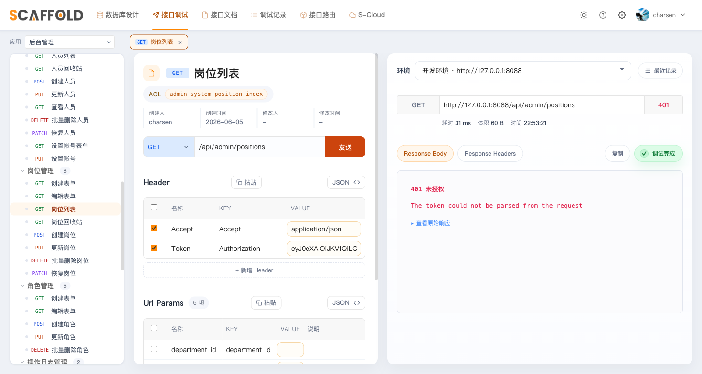
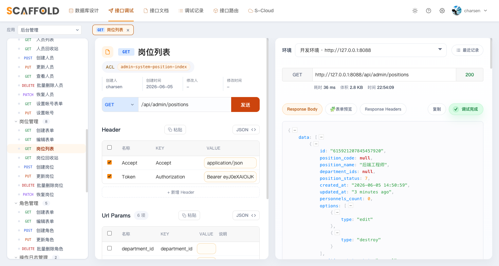

# 第 7 章　安装 moo-system（进阶：完整系统管理）

目标：接入 `moo-system`，加入部门、岗位、人员、角色、授权和操作日志，
并把后台认证主体从 User 切换为 Personnel。

> moo-system 是可选商业包，需要授权访问。未安装时，前 6 章的 User + JWT + ACL 仍可独立使用。

---

## 7.0 先选路线

本章以后不再全部是新手必做项，先按目标选路线：

| 你的目标 | 推荐入口 |
|---|---|
| 从零理解 moo-system 怎样接进已有 Laravel 项目 | 继续完成本章 7.1–7.8 |
| 直接从骨架创建新的业务项目 | 跳到[第 12 章](./12-从骨架起手新项目.md)，用 `./init-project` 一次完成 |
| 已有完成态项目，只想学习日常加字段/接口 | 跳到[第 9 章](./09-增量开发工作流.md)的 9.2–9.7 主线 |
| 准备部署 | 完成本章测试后看[第 8 章](./08-部署上线.md) |

本章仍保留逐项接线过程，因为它解释了包与 host 的边界；新项目不需要手工重演这些复制步骤。

## 7.1 接入包

**前置：拿到私有仓库访问权。** `moo-system` 与其上传基础依赖 `moo-upload` 都是私有包，
安装前要先联系作者获取授权，并确保本机 / 部署机的 Gitee SSH key 能读取两个仓库：

```bash
git ls-remote git@gitee.com:charsen/moo-system.git
git ls-remote git@gitee.com:charsen/moo-upload.git
```

没有访问权，下面的 `composer update` 第一步就会失败（Composer 拉不到 VCS 仓库）。

把 `system` 仓库加进 `engine/composer.json` 的 `repositories`。下面片段只示意要**新增**
`system` 与 `upload` 两项；开源包保持正式版本约束安装，私有包使用授权 VCS：

```json
"require": {
    "charsen/moo-scaffold": "^2.1.3",
    "charsen/moo-monitor-laravel": "^0.1",
    "charsen/moo-system": "^1.6.25",
    "charsen/moo-upload": "^0.1.1"
},
"repositories": [
    {
        "name": "system",
        "type": "vcs",
        "url": "git@gitee.com:charsen/moo-system.git"
    },
    {
        "name": "upload",
        "type": "vcs",
        "url": "git@gitee.com:charsen/moo-upload.git"
    }
]
```

> composer **不会**读依赖包自带的 repositories 声明；即使 `moo-upload` 是
> `moo-system` 的直接依赖，Host 仍必须声明它的私有仓库。

安装前先检查第 2 章的 `iResource` 契约：

```bash
php artisan tinker --execute="dump(Route::hasMacro('iResource'));"
# true
```

`moo-system` 会在它的 ServiceProvider `boot()` 阶段加载包路由，因此这个宏必须在
更早的 `AppServiceProvider::register()` 里就可用。输出不是 `true` 时先回到 2.3 节修正，
不要带着错误继续安装。

检查通过后安装（会自动带入 kalnoy/nestedset、maatwebsite/excel、jenssegers/agent 等依赖）：

```bash
composer update charsen/moo-system charsen/moo-upload --with-all-dependencies
```

> 如果 Composer 末尾仍报 `Attribute [iResource] does not exist`，不是“预期坑”，而是第 2 章
> 没有按最终代码完成；回到 2.3 节修正后再重跑 Composer。

第 4 章建立的 `composer.production.json` 还是当时的最小版本，不含 `moo-system`、
`predis/predis`、`tucker-eric/eloquentfilter` 和部署脚本依赖的私包 manifest。此处必须同步升级，
否则开发环境看似完成，到了第 8 章生产安装时才会失败。在项目根目录执行：

> 下文复制的参考仓库必须与当前教程来自同一 tag 或 commit。不要把新版主分支的
> 最终态文件复制到旧版依赖中。

```bash
REFERENCE_ENGINE=../moo-engine-skeleton/engine   # 按你的实际位置调整
test -f "$REFERENCE_ENGINE/composer.production.json"

cp "$REFERENCE_ENGINE/composer.production.json" engine/composer.production.json
cd engine
COMPOSER=composer.production.json composer validate --no-check-publish
COMPOSER=composer.production.json composer update --dry-run --no-install --no-scripts
cd ..
```

这只校验并解析生产依赖，不会创建 `engine/composer.production.lock`，也不会安装依赖或提前触发
生产 Composer 的 Artisan 脚本；当前开发目录的 `vendor/` 仍保持开发版，不会删掉测试工具。

## 7.2 提供 host 端契约（4 个文件 + 1 个全局函数）

moo-system 的控制器/模型只依赖 3 个 host 业务契约；人员头像上传已统一由包内
`MooUploadPersonnelAvatarManager` 与私有 `moo-upload` 完成。另保留 Host Notification 的媒体 URL 解析，共准备以下 4 个文件：

```
engine/app/Admin/Controllers/Traits/BaseActionTrait.php  ← 必需契约；覆盖第 2 章 scaffold 生成的精简版
engine/app/Models/Notification.php                       ← 必需契约
engine/app/Notifications/SendBlessMessage.php            ← 必需契约
engine/app/Models/Traits/MediaSynchronous.php             ← 只供 host Notification 解析媒体 URL
```

前三份是 moo-system 的必需 host 契约；`MediaSynchronous` 是本教程选择的 Host 实现，不会由包通过
`vendor:publish` 自动写入你的项目。人员头像统一走包内 `PersonnelAvatarManager`，Host 不再提供
上传控制器、临时清理器、`UploaderTrait`，也不让 `Personnel` 使用 `MediaSynchronous`。
方式 B 的项目与教程仓库是两个并列目录；在你的项目根目录（`moo-engine-from-zero/`）
执行第 7 章同步器。它会一次准备本章后续需要的 host 契约、Personnel 登录控制器、Seeder、
操作日志、最终测试文件和 HTTP 诊断助手；默认只预览，`--execute` 才写入。

如果你只在看线上教程，先把开源骨架仓库 clone 到旁边，并确保它与当前教程来自同一 tag/commit：

```bash
# 只看线上教程、本机还没有参考仓库时才需要这行
git clone https://gitee.com/charsen/moo-engine-skeleton.git ../moo-engine-skeleton

REFERENCE_ROOT=../moo-engine-skeleton   # 路径不同就改成你的实际位置

# 先审阅 create / overwrite 清单，不写文件
php "$REFERENCE_ROOT/tools/tutorial-sync-chapter7.php" --target=.

# 确认后执行；旧文件自动备份到 .tutorial-backups/chapter7-时间戳-随机后缀/
php "$REFERENCE_ROOT/tools/tutorial-sync-chapter7.php" --target=. --execute
```

> 同步器只复制明确列出的本章文件，不改配置、数据库或其它业务代码。它会覆盖第 2 章的精简
> `BaseActionTrait`，这正是本节需要的升级；如果目标有本地改动，先查看自动备份再继续。
> 复制后可执行
> `rg 'Mooeen\\Scaffold\\Concerns\\UsingSnowFlakePrimaryKey' engine/app/Models/Notification.php`
> 做一次版本检查：当前版应复用 moo-scaffold 的共享雪花 ID 实现，不再依赖旧的
> `App\Models\Traits\UsingSnowFlakePrimaryKey`。

头像控件默认指向 `api/admin/uploads?purpose=moo-system.personnel.avatar`。临时对象、引用消费、
过期恢复与清理由 `moo-upload` 统一管理；Host 不再注册另一套 `upload/image` 路由或临时目录。

还差一个全局函数 `toLabelValue()`（部门控制器在用）。
**新建文件** `engine/app/Helpers/helpers.php`，内容如下：

```php
<?php

if (! function_exists('toLabelValue')) {
    /**
     * 把数据集转成前端「label-value」选项结构（支持树状 children 与关联子项）。
     *
     * @param  array  $data  数据集（数组）
     * @param  string  $key_field  作为 value 的字段名
     * @param  string  $label_field  作为 label 的字段名
     * @param  string  $count_field  可选：作为 count 的字段名
     * @param  array  $other  可选：关联子项 [关联字段, 子value字段, 子label字段, 前缀?]
     */
    function toLabelValue(array $data, string $key_field, string $label_field, string $count_field = '', array $other = []): array
    {
        $res = [];
        foreach ($data as $one) {
            $tmp = ['value' => $one[$key_field], 'label' => $one[$label_field]];

            if ($count_field !== '') {
                $tmp['count'] = $one[$count_field];
            }

            if (! empty($one['children'])) {
                $tmp['children'] = toLabelValue($one['children'], $key_field, $label_field, $count_field, $other);
            }

            // 处理 model 的关联数据（已是最后一级）
            if (! empty($other) && ! empty($one[$other[0]])) {
                $select = [];
                $prefix = $other[3] ?? ' · ';
                foreach ($one[$other[0]] as $o) {
                    $select[] = ['value' => $o[$other[1]], 'label' => $prefix.$o[$other[2]]];
                }
                $tmp['children'] = isset($tmp['children']) ? array_merge($tmp['children'], $select) : $select;
            }

            $res[] = $tmp;
        }

        if (empty($res)) {
            $res = [['label' => '暂无相关数据', 'value' => '']];
        }

        return $res;
    }
}
```

然后在 `composer.json` 的现有 `autoload` 中加入 `files`。下面是可直接替换的完整
`autoload` 段，不要把省略号写进 JSON：

```json
"autoload": {
    "psr-4": {
        "App\\": "app/",
        "Database\\Factories\\": "database/factories/",
        "Database\\Seeders\\": "database/seeders/"
    },
    "files": [
        "app/Helpers/helpers.php"
    ]
}
```

```bash
composer dump-autoload
php -r "require 'vendor/autoload.php'; var_dump(function_exists('toLabelValue'));"
# bool(true)
```

> 缺少 `toLabelValue()` 时，部门列表会返回 500。完整异常栈可在
> `storage/moo-monitor/runtimes/open/` 查看。

## 7.3 后台主体切换：User → Personnel

这是本章的核心动作，也是第 3 章设计的回报时刻——只动两个文件
（机制层的中间件 / 路由 / Gate / 移动端 user 守卫全都不碰）：

**① `config/auth.php`**：两处改动——`admin` 守卫的 `provider` 改一行指到
`personnels`，再在 `providers` 里**新增一段** `personnels` 数组项
（`user` 守卫**不动**，移动端继续用自建 User）：

```php
'guards' => [
    'web'   => ['driver' => 'session', 'provider' => 'users'],
    'admin' => ['driver' => 'jwt', 'provider' => 'personnels'],   // ← 只改 provider
    'user'  => ['driver' => 'jwt', 'provider' => 'users'],        // ← 不动
],
'providers' => [
    'users'      => ['driver' => 'eloquent', 'model' => App\Models\User::class],
    'personnels' => ['driver' => 'eloquent', 'model' => Mooeen\System\Models\Personnel::class],  // ← 新增整项
],
```

> 不要在 `jwt` 守卫里加 `hash => false`。那是 Laravel 内置 `token` 守卫的配置项，
> jwt-auth 创建 `JWTGuard` 时不读它。本项目的密码校验明确发生在登录控制器的
> `Hash::check()`，与 guard 配置无关。

> 顺带说明：本骨架 `config/auth.php` 的默认守卫早已是
> `'guard' => env('AUTH_GUARD', 'admin')`（第 3 章改的，API 后端以后台为主入口），
> 不是 Laravel 教科书默认的 `web`——这处**不需要**在本章再动。

**② `app/Admin/Controllers/AuthController.php`** 换成 Personnel 版
（需要将第 3 章的 User 版改为 Personnel 版）。与第 3 章 User 版的差异一目了然：

这个控制器包含登录统计和登录 token 记录同步，不要凭差异描述手工猜着改。
7.2 的同步器已经换成同版本 Personnel 版；直接打开
`engine/app/Admin/Controllers/AuthController.php` 对照下面六个验收点。

复制后再读一遍下面六个差异，它们是验收点，不是让你自行补全代码的提示：

- 查询主体：请求体字段统一叫 **`account`**，控制器拿它**同时匹配姓名或手机号**——
  `Personnel::where('real_name', $params['account'])->orWhere('mobile', $params['account'])`。
  所以 7.8 登录时传的是 `{"account":"13800000000",...}`，而不是 `mobile`；
- 状态检查：字段是 int，必须与 `AccountStatus::FORBIDDEN->value` 比较；
- 登录后更新 `login_times / last_login_at / last_login_ip / last_login_endpoint`，再派发
  `SaveLoginJob` 创建 `system_logins` 记录；
- `refresh()` 派发 `UpdateLoginTokenJob` 更新 token 与刷新次数；
- `logout()` 在永久拉黑 JWT 前调用 `LoginManagement::setInvalidStatus()`，同步把当前登录记录标为失效；
- database / beanstalkd / sqs / redis 四个异步连接统一配置 `after_commit=true`，避免事务回滚后 Job 已经入队。

## 7.4 包路由接线 + 迁移 + 自检

发布包配置并指到第 3 章预埋的 `moo-system` 中间件组：

```bash
php artisan vendor:publish --tag=moo-system-config
```

```php
// config/moo-system.php
'admin' => ['prefix' => 'api/admin', 'name' => 'admin.', 'middleware' => 'moo-system'],
```

发布 `moo-upload` 配置并将管理路由指向独立安全组：

```bash
php artisan vendor:publish --tag=moo-upload-config
```

```php
// config/moo-upload.php
'admin' => ['prefix' => 'api/admin', 'name' => 'admin.upload.', 'middleware' => 'moo-upload'],
```

`bootstrap/app.php` 还要定义独立 `moo-upload` 组，内容与 `moo-system` 的强制认证链等价，但不能借用另一个包名。

把 moo-system 与 moo-upload 的控制器都登记进 scaffold（`config/scaffold.php`）——
ACL key 的命名空间反查、接口文档、调试器联调都依赖这一步，**必须在跑测试之前做**：

```php
'controller' => [
    'admin' => [
        // ...
        'extra_modules' => [
            'System' => 'Mooeen\\System\\Http\\Controllers\\Admin',
            'Upload' => 'Mooeen\\Upload\\Http\\Controllers\\Admin',
        ],
    ],
],
```

配置好 `extra_modules` 后立即让 scaffold 从**真实路由**重建后台 ACL 动作树：

```bash
php artisan moo:auth admin
```

这一步会更新 `config/actions.php`、两份 actions 语言文件和
`scaffold/acl/admin.yaml`。不跑它的话，root 管理员可能靠 `is_root` 看起来一切正常，
但普通角色根本没有 moo-system 动作可授权。7.5 还会在生成结果上手动合并个人中心白名单；
以后再跑 `moo:auth` 时也要重新合并。

迁移（包内 migration 自动加载）+ 5 项自检：

```bash
php artisan migrate             # 建 system_* 共 10 张核心表，并执行包的后续变更迁移
php artisan moo-system check    # 当前应 5/5 全绿
```

```
✓ Auth provider 配置真实 FQN
✓ 包路由使用的 middleware group 含 jwt.auth.refresh
✓ Composer classmap 不含已删除的 App\Models\System\*
✓ Host 端 3 个必需契约 trait/class 全部存在
✓ config:cache 与 source 一致
🎉  All 5 required checks passed. moo-system 配置健康。
```

> `Route::iResource` 已在 7.1 安装前单独检查；当前 `moo-system check` 的输出不再
> 把它重复计入 5 项 host 集成检查。

> 自检读取的是 `config('moo-system.admin.middleware')` 指向的 `moo-system` 组，
> 不是需要放行登录接口的 `admin` 组。

## 7.5 初始数据：角色 → 部门 → 岗位 → 人员

4 个 seeder 及按顺序调用它们的 `DatabaseSeeder` 已由 7.2 同步器准备好；完整代码位于
`engine/database/seeders/`。本节只理解数据关系、补 ACL 白名单并执行 seed，不再重复复制文件。

| Seeder | 内容 |
|---|---|
| `RoleSeeder` | 系统管理员（授 `is_root` 字面量 = 超级权限，对应 ACL Gate 第 ③ 优先级）/ 开发 / 编辑员 |
| `DepartmentSeeder` | 猫途科技（根）→ 技术部[后端组/前端组] / 市场部（嵌套集树 `_lft/_rgt`） |
| `PositionSeeder` | 后端工程师 / 前端工程师 / 市场专员 |
| `PersonnelSeeder` | 管理员 `13800000000` / `admin888`，挂技术部·后端工程师·系统管理员角色 |

> 这些 seeder 只用于本地学习和测试，包含公开演示密码。复制后的 `DatabaseSeeder`
> 会在 `APP_ENV=production` 主动拒绝运行；生产初始账号流程见第 8 章。

> 「第 ③ 优先级」回指第 5 章 Gate 闭包的判定顺序：① `isRoot()` 天然 root 直通
> → ② `config/actions.php` 白名单 → ③ `getActions()` 含 `'is_root'` 字面量 = 超级权限
> → ④ 精确匹配 acl key。

> `DatabaseSeeder` 不要使用 `WithoutModelEvents`，否则 Department 的嵌套集字段无法维护。
> 从 moo-system 1.6.24 起，超级管理员固定为 `id=1`；`reset-root-password` 在缺失时会创建
> `real_name=root`、`mobile=13300000001` 的正常帐号。演示角色仍保留 `is_root`，用于教学普通角色授权。

**ACL 白名单**：开着 ACL 接入 moo-system 后，`config/actions.php` 的 `whitelist`
必须放行**个人中心**的 8 个动作（查看资料、改密码、改头像等），否则普通用户会收到 403。
刚才的 `moo:auth admin` 在当前版本会自动留下「本人信息」的
`84470713dcb9a7c9`；在同一个 `admin.whitelist` 数组中手动补下面 7 个（已有的值不要删）：

```php
'f6d488cc41bea74a', // admin-system-admin-edit          个人中心·编辑表单
'b00ef1ce449c970b', // admin-system-admin-update        个人中心·更新资料
'cbc32275c4bdb06c', // admin-system-admin-password-form 个人中心·改密码表单
'88e610dbb210a3dc', // admin-system-admin-password      个人中心·修改密码
'1fcbfd9524aebb83', // admin-system-admin-avatar-form   个人中心·头像表单
'd59a5622ff031201', // admin-system-admin-avatar        个人中心·更新头像
'e389e65e330e8af2', // admin-system-admin-logins        个人中心·登录记录
```

先验证 8 个目标 key 都在，再 seed：

```bash
php artisan tinker --execute='$w=config("actions.admin.whitelist",[]); $keys=["84470713dcb9a7c9","f6d488cc41bea74a","b00ef1ce449c970b","cbc32275c4bdb06c","88e610dbb210a3dc","1fcbfd9524aebb83","d59a5622ff031201","e389e65e330e8af2"]; dump(array_values(array_diff($keys,$w)));'
# []

php artisan db:seed
```

再初始化本地 root；命令默认两次隐式输入密码，不把密码写进 shell history：

```bash
php artisan moo-system reset-root-password
```

生产非交互自动化只能在受控凭据注入场景使用 `--password=<新密码> --force`；不要把真实密码写进仓库脚本。

seed 完不只看「DONE」，再检查组织树和管理员关联：

```bash
php artisan tinker --execute='$p=Mooeen\System\Models\Personnel::where("mobile","13800000000")->firstOrFail(); dump(["departments"=>Mooeen\System\Models\Department::count(),"roles"=>Mooeen\System\Models\Role::count(),"positions"=>Mooeen\System\Models\Position::count(),"department"=>$p->department?->department_name,"position"=>$p->position?->position_name,"roles_of_personnel"=>$p->roles->pluck("role_name")->all(),"password_ok"=>Illuminate\Support\Facades\Hash::check("admin888",$p->password),"tree_errors"=>Mooeen\System\Models\Department::countErrors()]);'
# departments=5 / roles=3 / positions=3 / 技术部 / 后端工程师 / [系统管理员]
# password_ok=true；tree_errors 的 4 项都是 0
```

## 7.6 操作日志

moo-system 提供了 `system_operation_logs` 表和写库 Job，采集点由 host 决定。三步：

**① 中间件文件**：7.2 同步器已经准备好
`app/Http/Middleware/OperationLog.php`（terminable、敏感参数 `[FILTERED]`、响应按 6 万字节做
UTF-8 安全截断）。这里无需再次复制，确认文件存在后继续挂载。

**② 挂到两个组的末尾**：`admin` / `moo-system` 两个中间件组都注册在
`engine/bootstrap/app.php` 的 **`withMiddleware()`** 里（仓库版的
`OperationLog::class` 已在两组末位，照抄即可）。`AppServiceProvider::boot()` 在 Console
环境会解析 HTTP Kernel，因此 Artisan 自检读取的仍是这里的同一份组配置，不需要复制一套。

```php
use App\Http\Middleware\OperationLog;

$middleware->group('admin', [
    'jwt.assign.guard:admin',
    'throttle:admin',
    'set.locale',
    SubstituteBindings::class,
    OperationLog::class, // 放末尾
]);

$middleware->group('moo-system', [
    'jwt.assign.guard:admin',
    'jwt.guard.auth:admin',
    'jwt.auth.refresh',
    'throttle:admin',
    'set.locale',
    SubstituteBindings::class,
    OperationLog::class, // 放末尾
]);
```

**③ 打开开关**：`config/logging.php` 里是
`'operation' => env('OPERATION_LOG', false)`——**默认关闭**。
`.env` 里加上两行，否则照做到底日志也可能永远 0 条：

```bash
OPERATION_LOG=true
QUEUE_CONNECTION=sync
```

然后用 `Ctrl+C` 完整停掉第 1 章启动的服务，重新执行：

```bash
PHP_CLI_SERVER_WORKERS=4 php artisan serve --host=127.0.0.1 --port=8088 --no-reload
```

新开一个终端，发一次失败登录来验证「未登录身份 + 密码脱敏 + 同步落库」：

```bash
. ../tools/tutorial-http.sh

tutorial_http_call 422 POST http://127.0.0.1:8088/api/admin/authenticate \
  -H "Content-Type: application/json" \
  -d '{"account":"nobody","password":"super-secret"}'

php artisan tinker --execute='$l=Mooeen\System\Models\OperationLog::latest("id")->firstOrFail(); dump(["personnel_id"=>$l->personnel_id,"method"=>$l->request_method,"url"=>$l->request_url,"status"=>$l->response_code,"request_param"=>$l->request_param]);'
# personnel_id=null / POST / api/admin/authenticate / 422 / password="***"
```

> 当前 moo-system 的明确业务规则是**root 不记录操作日志**，包内 Job 也会再拦一次；
> 所以不要拿 7.5 种子里唯一的 root 管理员发一次 200 请求、然后以「日志仍是 0」
> 判定接入失败。上面故意用失败登录验证基础链路；要验证已登录业务操作，
> 需要再建一个非 root 人员。对审计要求较高的业务，应重新评估「root 豁免审计」这条产品规则。

> 操作耗时使用 `$request->server('REQUEST_TIME_FLOAT')`，不要依赖测试入口未定义的
> `LARAVEL_START`。异步队列环境还需启动 queue worker；修改 `.env` 后要重启开发服务。

## 7.7 测试换最终版

第 4 章手写的 User 版 AuthTest 完成了历史使命。本章涉及 4 个测试文件，
**前 3 个换成仓库最终版，第 4 个不动**：

| 文件 | 动作 |
|---|---|
| `tests/TestCase.php` | 换最终版（含 `freshJwtProcess()` 等测试基建） |
| `tests/Feature/AuthTest.php` | 换 Personnel 版（登录字段 `account` = `13800000000`） |
| `tests/Feature/FoodAclTest.php` | 换角色版（授权写进 `$role->role_actions`） |
| `tests/Feature/MobiAuthTest.php` | **不用动**（第 6 章的 User 版、email 登录，本就是终态） |

7.2 同步器已经把表格中的最终版和 4 个守护测试放进 `engine/tests/`，无需再逐个复制。

同时确认 `phpunit.xml` 里有这行测试用 JWT 密钥（没有它 JWT 测试起不来）：

```xml
<env name="JWT_SECRET" value="testing-secret-do-not-use-in-production"/>
```

运行完整回归测试：

```bash
php artisan test --stop-on-failure
```

所有测试都应通过。`FoodAclTest` 的主体已从 User actions 切换为 Personnel 角色，
Gate 契约不变。

## 7.8 在 scaffold 调试器里联调

先用多 worker 启动本地服务，避免调试器回调被单线程服务阻塞：

```bash
PHP_CLI_SERVER_WORKERS=4 php artisan serve --host=127.0.0.1 --port=8088 --no-reload
```

7.4 已把控制器登记进 scaffold（extra_modules），现在生成接口文档、刷新调试器：

```bash
php artisan moo:api admin System
```

左侧多出「系统管理」整组（部门 / 岗位 / 人员 / 角色 / 授权 / 通知机器人 / 登录 / 操作日志 / 个人信息）：



登录拿 token——注意主体已是 Personnel，请求字段是 `account`（7.3 说过：
控制器拿它同时匹配姓名或手机号）：`{"account":"13800000000","password":"admin888"}`。
点开「岗位管理 → 岗位列表」，在 Header 区把 **Authorization 填成 `Bearer <token>`**
（必须包含 `Bearer ` 前缀），发送后应返回 200：



再用 curl 走一遍 CRUD（岗位名换个 seeder 里没有的，重名会撞唯一校验 422）：

```bash
. ../tools/tutorial-http.sh
BASE=http://127.0.0.1:8088

system_crud_smoke() {
  tutorial_http_token '后台登录' POST "$BASE/api/admin/authenticate" \
    -H 'Content-Type: application/json' \
    -d '{"account":"13800000000","password":"admin888"}' || return 1
  TOKEN=$TUTORIAL_HTTP_TOKEN

  tutorial_http_call 200 GET "$BASE/api/admin/departments?page=1&page_limit=10" \
    -H 'Accept: application/json' -H "Authorization: Bearer $TOKEN" || return 1

  tutorial_http_call 201 POST "$BASE/api/admin/positions" \
    -H 'Content-Type: application/json' -H "Authorization: Bearer $TOKEN" \
    -d '{"position_name":"测试工程师"}'
}
system_crud_smoke
```

---

## 本章产出

- moo-system 接入完成，`moo-system check` 全部通过；
- 后台主体从 User 切换为 Personnel，原有中间件、路由、Gate 和移动端守卫保持不变；
- 角色制授权接管 ACL（白名单放行个人中心），操作日志落库（记得 `OPERATION_LOG=true`）；
- 自动测试和调试器联调通过。

**主线教程完成。** 你现在拥有：代码生成（moo-scaffold）+ 自建用户 JWT + 动作级 ACL +
双守卫隔离的移动端 + 完整系统管理（moo-system）。
踩坑速查见 [docs/README.md](./README.md)。

下一章（可选）：把它部署到真正的服务器上。
