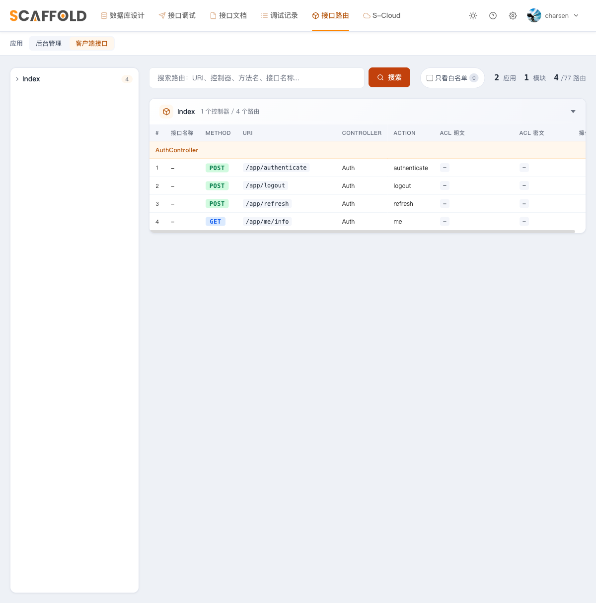

# 第 7 章　移动端分片与 user 守卫

目标：启用一直空着的 `app/Api/` 分片（移动端，路由前缀 `app`），用 **user 守卫**登录，
做到两件事：① 后台 token 和移动端 token **互不通用**（双向隔离）；
② 移动端刷新是**单设备语义**（旧 token 立即作废，没有 90 秒宽限）。

---

## 7.1 地基早就铺好了

第 3 章接线时这些已经就位，本章只是用起来：

- `config/auth.php`：`user` 守卫（jwt + personnels）；
- `client` 中间件组：`jwt.assign.guard:user` + 限流，挂在 `app` 前缀上；
- `jwt.guard.auth:user`：校验 token 里的 guard 声明必须是 `user`。

> 真实项目的移动端主体通常是独立的会员表（Member）。骨架复用 Personnel 只为演示，
> 什么时候该拆出去见 7.5。

## 7.2 写移动端登录控制器

新建 `app/Api/Controllers/AuthController.php`（完整文件见仓库），结构和后台版一样
（手动查用户 → `Hash::check` → 账号状态检查 → 签发），**三处不同**：

**① 签发时显式声明 guard：**

```php
$token = Auth::guard('user')->claims(['guard' => 'user'])->login($user);
```

> moo-system 的 `getJWTCustomClaims()` 旧版硬编码 `guard=admin`（坑 #17），那时不覆盖
> 的话移动端 token 过不了 `:user` 校验。包里已修成动态跟随当前守卫，这行内联声明
> 现在是**冗余保险**——故意留着：守卫隔离失效是静默的（登录 200，撞上校验才 401），
> 一行冗余换掉一类难排查的故障。

**② 刷新用单设备语义：**

```php
$token = Auth::guard('user')->refresh(true, false);
// forceForever=true：旧 token 立即永久作废，没有 90 秒宽限 —— 新设备登录顶掉旧设备
```

一句话记忆：**后台怕并发打架要宽限（false）；移动端要单设备，不能宽限（true）。**

**③ 登出同样走永久拉黑：** `Auth::guard('user')->logout(true);`

refresh 的 try/catch + `UpdateLoginTokenJob` 写法与第 5 章的后台版完全相同。

## 7.3 路由（`routes/api.php`）

```php
Route::post('authenticate', [AuthController::class, 'authenticate'])->name('authenticate');
Route::post('logout', [AuthController::class, 'logout'])->name('logout');

// 主动刷新：单独挂 guard 校验，不进 jwt.auth.refresh（孤儿 token 问题，同第 5.4 节）
Route::post('refresh', [AuthController::class, 'refresh'])
    ->middleware('jwt.guard.auth:user')->name('refresh');

Route::group(['middleware' => ['jwt.guard.auth:user', 'jwt.auth.refresh']], function () {
    Route::get('me/info', [AuthController::class, 'me'])->name('me.info');

    // :insert_code_here:do_not_delete   ← 生成器插入的移动端路由默认就在保护圈里
});
```

写好后在 `/scaffold/routes` 切到「客户端接口」应用，能看到移动端的全部路由：



## 7.4 真机验证

```bash
BASE=http://127.0.0.1:8088

# ① 移动端登录（注意前缀是 app，不是 api/admin）
APP_TOKEN=$(curl -s -X POST $BASE/app/authenticate \
  -H "Content-Type: application/json" \
  -d '{"account":"13800000000","password":"admin888"}' \
  | sed -n 's/.*"token":"\([^"]*\)".*/\1/p')

# ② 解码 payload 看 guard。JWT 用的是 base64url（- _ 替代 + /，且不带 padding），
#    先转回标准 base64 再补 = 号，否则可能解出半截：
P=$(echo $APP_TOKEN | cut -d. -f2 | tr '_-' '/+'); P="$P$(printf '=%.0s' $(seq $(( (4 - ${#P} % 4) % 4 ))))"
echo $P | base64 -d
# {"iss":...,"guard":"user",...}

# ③ 各回各家 200
curl -s -o /dev/null -w "%{http_code}\n" $BASE/app/me/info -H "Authorization: Bearer $APP_TOKEN"   # 200

# ④ 双向隔离 401（ADMIN_TOKEN 按第 4 章登录后台拿）
curl -s -o /dev/null -w "%{http_code}\n" $BASE/app/me/info -H "Authorization: Bearer $ADMIN_TOKEN"        # 401
curl -s -o /dev/null -w "%{http_code}\n" $BASE/api/admin/me/info -H "Authorization: Bearer $APP_TOKEN"    # 401

# ⑤ 单设备刷新：拿新 token 后，旧 token 立刻 401（无宽限）
NEW=$(curl -s -X POST $BASE/app/refresh -H "Authorization: Bearer $APP_TOKEN" \
  | sed -n 's/.*"token":"\([^"]*\)".*/\1/p')
curl -s -o /dev/null -w "%{http_code}\n" $BASE/app/me/info -H "Authorization: Bearer $NEW"          # 200
curl -s -o /dev/null -w "%{http_code}\n" $BASE/app/me/info -H "Authorization: Bearer $APP_TOKEN"    # 401
```

测试守护：`tests/Feature/ApiAuthTest.php` 5 个用例（401 / 登录 / 双向隔离 /
单设备刷新 / 过期 token 刷新只产生一个新 token）。

```bash
php artisan test --filter=ApiAuthTest
# Tests: 5 passed
```

## 7.5 什么时候把 Personnel 换成真会员表

出现任一信号就该建独立的 `Member` 模型：注册开放给外部用户、移动端字段和员工表
开始分叉（昵称 / 第三方 openid）、要做验证码登录。迁移路径：

1. 建表 + 模型实现 `JWTSubject`（`getJWTCustomClaims` 返回 `['guard' => 'user']`）；
2. `config/auth.php` 给 `user` 守卫换 provider。

路由和中间件一行都不用动。

---

## 本章产出

- `Api/` 分片启用：登录 / me / 刷新 / 登出四件套（user 守卫）；
- admin ↔ user token 双向隔离，移动端单设备刷新语义；
- 5 个测试守护，curl 真机验证通过。

至此 README 的全部目标完成：代码生成、系统管理、JWT、ACL、双守卫——
都有教程、有测试、真机验证过。踩坑速查表（21 条）见 [docs/README.md](./README.md)。
