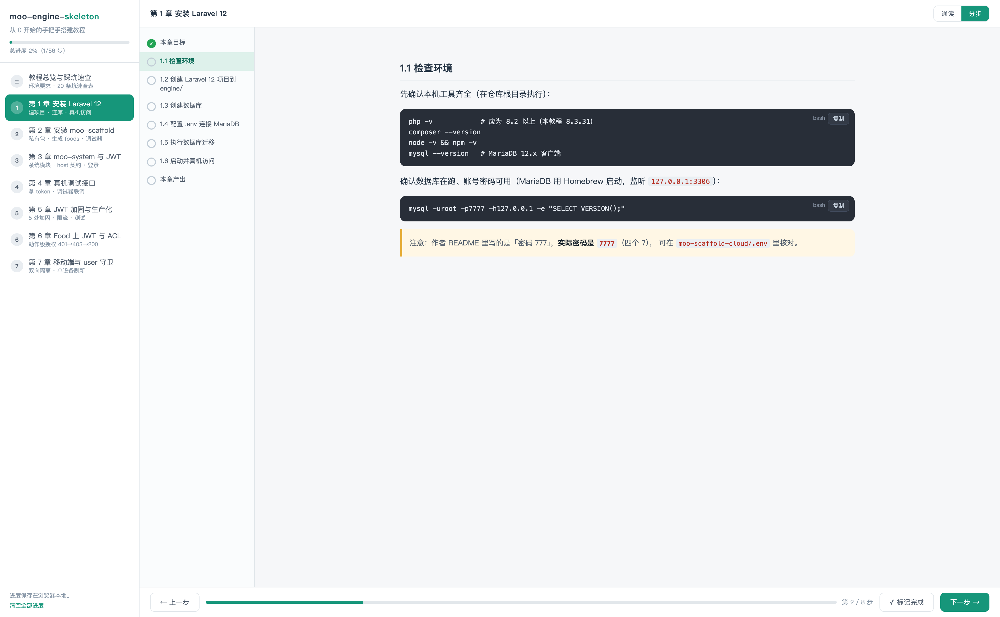

# moo-engine-skeleton 从 0 开始搭建教程

这是一套**面向新手**的后端开发骨架教程：从一个空目录开始，一步步搭出一个带
**代码生成器（moo-scaffold）**、**系统管理模块（moo-system：部门 / 岗位 / 人员 / 角色 / 授权）**
和 **JWT 登录认证** 的 Laravel 12 后端骨架。

> 🎯 **推荐的阅读方式**：本目录自带一个零依赖的网页引导器（`docs/index.html`，
> 单文件含全部 CSS/JS），支持分步模式、进度记忆、代码一键复制：
> ```bash
> cd docs && php -S 127.0.0.1:9999     # 或 python3 -m http.server 9999
> # 浏览器打开 http://127.0.0.1:9999
> ```
> 

> 本教程遵循两条原则：
> 1. **每一步都有操作记录**，命令和结果都照实写下来，方便照着做；
> 2. **每一步都用真机测试**（启动真实服务、用浏览器/接口真实请求验证），而不是只写代码。

## 环境要求

| 软件 | 版本（本教程实测） | 说明 |
|---|---|---|
| PHP | 8.3.31 | Laravel 12 要求 `^8.2` |
| Composer | 2.9.5 | PHP 包管理器 |
| Node / npm | 26 / 11 | 前端资源构建（可选） |
| MariaDB / MySQL | MariaDB 12 或 MySQL 8（实测均可） | 数据库；本机 `127.0.0.1:3306` |
| Git | 任意较新版本 | 已装 `git-lfs` |
| moo-scaffold / moo-system 源码 | dev-master | **必须**已克隆到与本仓库同级的目录（私有库，需作者授权），第 2 章用相对路径引用 |

数据库连接：**用户名 `root` / 密码 `7777`**，本教程用的数据库名是 **`moo_skeleton`**。

## 目录结构约定（重要）

Laravel 应用放在仓库的 **`engine/`** 子目录里，仓库根目录只放文档和部署脚本。
这和作者其它项目（`wisdomcity`、`light-language-engine`）保持一致，
私有包的相对路径也因此统一为 `../../moo-scaffold`。

```
moo-engine-skeleton/
├── README.md  CLAUDE.md          # 说明文档
├── docs/                         # 就是你正在看的这套教程
└── engine/                       # ← Laravel 12 应用本体（composer 命令都在这里执行）
```

## 章节

| 章节 | 内容 | 对应 README 步骤 |
|---|---|---|
| [第 1 章 安装 Laravel 12](./01-安装-laravel.md) | 创建项目、连接 MariaDB、建库、真机访问 | 步骤 1 |
| [第 2 章 安装 moo-scaffold](./02-安装-moo-scaffold.md) | 私有包接入（dev=路径 / prod=VCS）、设计 `foods` 表、一键生成业务代码、两种方式调接口 | 步骤 2 |
| [第 3 章 安装 moo-system（含 JWT）](./03-安装-moo-system-与-jwt.md) | 系统管理模块接入、host 契约、JWT 登录、`moo-system check`、迁移 | 步骤 3 + 5 |
| [第 4 章 真机调试 moo-system 接口](./04-真机调试-moo-system-接口.md) | 登录拿 token、鉴权验证、在 scaffold 调试器里带 token 联调 | 步骤 4 |
| [第 5 章 JWT 加固与生产化](./05-JWT-加固与生产化.md) | 对齐 wisdomcity 生产踩坑：persistent_claims、黑名单宽限、滑动续期、CORS、限流、操作日志、生产 composer、第一批接口测试 | 加固 |
| [第 6 章 给 Food 上 JWT 与 ACL](./06-给-Food-上-JWT-与-ACL.md) | 动作级授权完整闭环：Gate 契约、401→403→授权→200、is_root 超级权限、acl key 机制 | 加固 |
| [第 7 章 移动端分片与 user 守卫](./07-移动端分片与-user-守卫.md) | 启用 Api/ 分片：guard claim 覆盖、双向守卫隔离、单设备 refresh 语义 | 加固 |

> moo-system 的接口依赖 JWT 登录，所以 README 的第 3、5 步在第 3 章合并完成。

## 踩过的坑速查（新手必看）

| # | 现象 | 原因 / 解决 | 章节 |
|---|---|---|---|
| 1 | 生成 Model 报 `EloquentFilter\Filterable not found` | 装 `tucker-eric/eloquentfilter` + `godruoyi/php-snowflake` | 2 |
| 2 | 报 `BaseActionTrait not found` | `moo:free` 不建它，跑一次 `php artisan moo:controller Food -f` | 2 |
| 3 | `moo:free` 里 `moo:api` 提示 No routes matched | 路由刚插入、当前进程没刷新，单独补 `moo:api admin Food` | 2 |
| 4 | 调试器代理一直转圈 | 单线程 serve 自我代理死锁，用 `PHP_CLI_SERVER_WORKERS=4 ... --no-reload` | 2 |
| 5 | 装 moo-system 后 artisan 报 `Attribute [iResource] does not exist` | `iResource` 宏要注册在 `AppServiceProvider::register()` | 3 |
| 6 | 调部门列表报 `undefined function toLabelValue()` | 补 `app/Helpers/helpers.php` 并 `composer` files 自动加载 | 3 |
| 7 | `moo-system check` 的中间件组那项总 FAIL | 中间件组要注册到 router（provider boot），否则 console 看不到 | 3 |
| 8 | 调试器里带了 token 仍 401 | Authorization 值要加 `Bearer ` 前缀 | 4 |
| 9 | seed 后部门树 `_lft/_rgt` 错乱 | `DatabaseSeeder` 别用 `WithoutModelEvents`，否则静默 nestedset 事件 | 3 |
| 10 | token 续签后再请求偶发 401 `Guard Unverified` | jwt-auth 2.8.x 续签会丢自定义 claim（wisdomcity 生产踩过），`config/jwt.php` 的 `persistent_claims` 必须列上 `'guard'`（2.9.x 内部实现碰巧保留，但契约是它） | 5 |
| 11 | 页面并发请求时偶发 401（刚续签完） | 旧 token 续签后立刻进黑名单，同批在途请求被拒；`blacklist_grace_period` 设 90 秒宽限 | 5 |
| 12 | 前端跨域时拿不到续签的新 token | 新 token 在 `authorization` 响应头里，CORS 默认不暴露；发布 `config/cors.php` 设 `exposed_headers=['Authorization']` | 5 |
| 13 | 操作日志中间件报 `Undefined constant "LARAVEL_START"` | Laravel 12 入口不再定义它（老项目抄来的代码会炸），改用 `$request->server('REQUEST_TIME_FLOAT')` | 5 |
| 14 | Feature 测试里 refresh 永远"测不出"丢 claim | 同进程下 payload 工厂单例残留登录时的 claim；测试里 `emptyClaims()` 模拟真实跨进程 | 5 |
| 15 | 开了 ACL 后管理员自己也 403 | 雪花主键下没有 id=1 的天然 root；给「系统管理员」角色授 `is_root` 字面量兜底（RoleSeeder 已带） | 6 |
| 16 | 带 token 调接口报 422 误以为 ACL 没生效 | FormRequest 校验先于控制器 boot() 的鉴权，参数不合法先 422；带齐合法参数才能看到 403 | 6 |
| 17 | user 守卫发的 token 过不了 `jwt.guard.auth:user` | moo-system 旧版 `getJWTCustomClaims()` 硬编码 guard=admin（已在包 `fix/dynamic-guard-claim` 动态化）；骨架登录时仍 `claims(['guard'=>'user'])` 内联声明作冗余保险 | 7 |
| 18 | 过期 token 调 `/refresh` 后冒出两个有效新 token | `/refresh` 路由不能挂 `jwt.auth.refresh`——中间件和控制器各续签一次，响应头那个成孤儿 token；单独挂 `jwt.guard.auth` 即可 | 5 |
| 19 | 账号状态检查写了却不生效 | 枚举不进 `$casts`、字段是裸 int，`=== AccountStatus::FORBIDDEN`（enum 实例）永远 false，必须 `->value`（wisdomcity 的登录前置检查就是这种死代码） | 5 |
| 20 | 开 ACL 后零授权角色连个人中心都 403 | `config/actions.php` 白名单要放行 moo-system AdminController 的 8 个个人中心动作，否则自己锁死自己 | 6 |
| 21 | 操作日志表永远 0 条、也无报错 | `.env` 默认 `QUEUE_CONNECTION=database`，Job 堆在 `jobs` 表没人消费；改 `sync`（或起 worker），且改 `.env` 后要连 `php -S` 的 worker 一起杀掉重启 | 5 |
