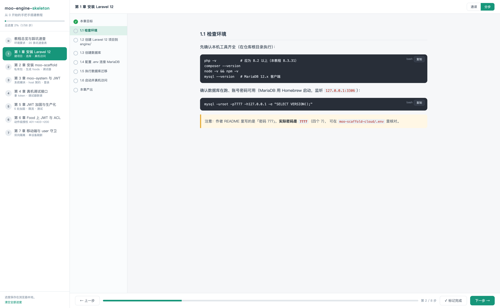

# moo-engine-skeleton 从 0 开始搭建教程

这套教程从空目录开始，搭建一个带代码生成、JWT 登录、ACL 和系统管理能力的
Laravel 12 后端。每章都包含操作、验证和常见错误处理。

## 第 0 步：把仓库拿到本地

```bash
git clone <本仓库地址> moo-engine-skeleton   # 地址以作者提供为准
cd moo-engine-skeleton
```

教程有两种走法，定义在[仓库根 README 的「快速开始」](../README.md)：

- **方式 A：从骨架起项目**：运行 `./init-project --name=<vendor/project>`，适合直接开发业务。
- **方式 B：从零跟教程搭**：从第 1 章开始，适合学习完整过程。

后文出现的「方式 A / 方式 B」均指这里。

第 7 章以后按目标选读，不需要把所有章节连续做完：

| 目标 | 最短路线 |
|---|---|
| 学习完整搭建过程 | 第 1–7 章 → 第 9 章 9.2–9.7 |
| 直接创建业务项目 | 直接看第 12 章，不必先重演第 1–11 章 |
| 部署已有项目 | 第 8 章 |
| 接云端监控 | 第 10 章（须已有 cloud token） |
| 开发/解耦扩展包 | 第 11 章 |
| 学习扩展包安全接入 | 第 13 章 |

第 9 章内部也已分层：9.2–9.7 是必做增量闭环，9.8–9.9 是业务扩展，
9.10–9.12 只在迁移、升级或旧前端适配时查阅。

推荐使用网页引导器阅读：

> ```bash
> cd docs && php -S 127.0.0.1:9999     # 或 python3 -m http.server 9999
> # 浏览器打开 http://127.0.0.1:9999
> ```
> 

## 环境要求

| 软件 | 版本（本教程实测） | 说明 |
|---|---|---|
| PHP | 8.2+ | Laravel 12 最低要求 |
| Composer | 2.9.5 | PHP 包管理器 |
| Node / npm | Node 26 / npm 11 | 可选；本教程不构建前端资源 |
| MariaDB / MySQL | MariaDB 12 或 MySQL 8 | 本机示例使用 `127.0.0.1:3306` |
| Git | 较新版本 | 本仓库不使用 git-lfs |
| moo-scaffold | `^2.1.3` | 第 2 章安装，开源 |
| moo-monitor-laravel | `^0.1` | 第 1.7 节安装，开源 |

先检查环境：

```bash
php -v              # 需 8.2+
composer -V
mysql --version
node -v && npm -v   # 可选，不做前端构建可跳过
```

数据库示例账号为 `root` / `7777`，请按本机配置替换。方式 B 使用独立练习库
`moo_engine_from_zero`：

```bash
mysql -uroot -p7777 -h127.0.0.1 -e \
  "CREATE DATABASE IF NOT EXISTS moo_engine_from_zero CHARACTER SET utf8mb4 COLLATE utf8mb4_unicode_ci;"
```

## 目录结构约定（重要）

Laravel 应用固定放在 `engine/`；Composer、Artisan、测试和 Pint 命令都在该目录执行。
仓库根目录只放教程、初始化器和部署脚本。

```
moo-engine-skeleton/
├── README.md  init-project       # 项目说明与初始化器
├── pull.sh  release-check.sh     # 部署脚本
├── docs/                         # 教程
└── engine/                       # Laravel 应用
```

## 章节

| 章节 | 内容 | 定位 |
|---|---|---|
| [第 1 章 安装 Laravel 12](./01-安装-laravel.md) | 项目、Pint、数据库、监控 | 基础 |
| [第 2 章 安装 moo-scaffold](./02-安装-moo-scaffold.md) | 设计 foods 表并生成 CRUD | 基础 |
| [第 3 章 JWT 登录认证](./03-JWT-登录认证-自建用户.md) | 登录、刷新、登出与双守卫 | 核心 |
| [第 4 章 JWT 生产化](./04-JWT-加固与生产化.md) | CORS、限流、续签与测试 | 核心 |
| [第 5 章 Food ACL](./05-给-Food-上-JWT-与-ACL.md) | 动作级授权闭环 | 核心 |
| [第 6 章 移动端守卫](./06-移动端分片与-user-守卫.md) | 分片接口与守卫隔离 | 核心 |
| [第 7 章 安装 moo-system](./07-安装-moo-system.md) | 人员、角色、部门与操作日志 | 进阶 |
| [第 8 章 部署上线](./08-部署上线.md) | Composer / Packagist 部署、Redis（雪花/黑名单）、nginx、supervisor、清缓存致 token 复活的坑 | 可选 |
| [第 9 章 日常增量开发](./09-增量开发工作流.md) | 改表、加动作、分片和 Resource | 进阶 |
| [第 10 章 云端监控](./10-云端监控进阶.md) | 聚合告警、MCP 与迁移 | 进阶 |
| [第 11 章 操作人契约](./11-操作人身份契约.md) | 统一操作人身份来源 | 进阶 |
| [第 12 章 从骨架起项目](./12-从骨架起手新项目.md) | 使用初始化器快速开工 | 实用 |
| [第 13 章 moo-feedback 用例](./13-moo-feedback-扩展包用例.md) | 匿名提交与独立后台认证组 | 实用 |

> moo-scaffold 和 moo-monitor-laravel 从 Packagist 安装。moo-system 与其上传基础依赖 moo-upload
> 通过私有源授权安装；前 6 章不依赖这两个私包。

## 踩过的坑速查

遇到报错时按现象查找；术语在对应章节解释。

| # | 现象 | 原因 / 解决 | 章节 |
|---|---|---|---|
| 1 | 生成 Model 报 `EloquentFilter\Filterable not found` | 当前 scaffold 已直接声明 `eloquentfilter` + `php-snowflake`；先用 `composer why` 确认依赖链，缺失说明 scaffold 安装不完整 | 2 |
| 2 | 报 `BaseActionTrait not found` | 当前正式版应由 `moo:free admin Food -a` 生成共享 trait；确认已安装教程指定版本，并按 2.6 重跑 `moo:fresh` → `moo:free` | 2 |
| 3 | `moo:free` 里 `moo:api` 提示 No routes matched | 检查 2.3 的路由插入标记与 `iResource` 宏；确认 Food 路由已生成后，补跑 `moo:auth admin` 和 `moo:api admin Food` | 2 |
| 4 | 调试器代理一直转圈 | 单线程 serve 自我代理死锁，用 `PHP_CLI_SERVER_WORKERS=4 php artisan serve --host=127.0.0.1 --port=8088 --no-reload` 启动 | 2 |
| 5 | 装 moo-system 后 artisan 报 `Attribute [iResource] does not exist` | 第 2 章的完整反射版 `iResource` 宏未正确注册在 `AppServiceProvider::register()`；回到 2.3 修正后重跑 Composer | 2 / 7 |
| 6 | 调部门列表报 `undefined function toLabelValue()` | 补 `app/Helpers/helpers.php` 并 `composer` files 自动加载 | 7 |
| 7 | `moo-system check` 的中间件组那项总 FAIL | 组统一写在 `bootstrap/app.php::withMiddleware()`；`AppServiceProvider::boot()` 的 Console 分支还要解析 HTTP Kernel，才能把同一份配置同步到 Router | 3 / 7 |
| 8 | 调试器里带了 token 仍 401 | Authorization 值要加 `Bearer ` 前缀 | 7 |
| 9 | seed 后部门树 `_lft/_rgt` 错乱 | `DatabaseSeeder` 别用 `WithoutModelEvents`，否则静默 nestedset 事件 | 7 |
| 10 | token 续签后报 401 `Guard Unverified` | `persistent_claims` 加入 `'guard'`，jwt-auth 固定为 `~2.8.3` | 4 |
| 11 | 页面并发请求时偶发 401（刚续签完） | 旧 token 续签后立刻进黑名单，同批在途请求被拒；`blacklist_grace_period` 设 90 秒宽限 | 4 |
| 12 | 前端跨域时拿不到续签的新 token | 新 token 在 `authorization` 响应头里，CORS 默认不暴露；发布 `config/cors.php` 设 `exposed_headers=['Authorization']` | 4 |
| 13 | 操作日志中间件报 `Undefined constant "LARAVEL_START"` | HTTP / artisan 入口会定义它，但 phpunit 不经过这两个入口；统一改用 `$request->server('REQUEST_TIME_FLOAT')` | 7 |
| 14 | Feature 测试测不出 refresh 丢 claim | 用 `freshJwtProcess()` 重置 JWT 服务，模拟跨进程请求 | 4 |
| 15 | 开了 ACL 后管理员自己也 403 | moo-system 1.6.24+ 用 `reset-root-password` 创建固定 id=1 root；教学普通管理员仍靠角色中的 `is_root`（RoleSeeder 已带） | 7 |
| 16 | 带 token 调接口报 422 误以为 ACL 没生效 | FormRequest 校验先于控制器 boot() 的鉴权，参数不合法先 422；带齐合法参数才能看到 403 | 5 |
| 17 | user 守卫发的 token 过不了 `jwt.guard.auth:user` | moo-system 旧版 `getJWTCustomClaims()` 硬编码 guard=admin（新版已动态化）；用旧版包给非 admin 守卫签发时要 `claims(['guard'=>...])` 内联覆盖 | 7 |
| 18 | 过期 token 调 `/refresh` 后冒出两个有效新 token | `/refresh` 路由不能挂 `jwt.auth.refresh`——中间件和控制器各续签一次，响应头那个成孤儿 token；单独挂 `jwt.guard.auth` 即可 | 4 |
| 19 | 账号状态检查不生效 | 裸 int 字段要与 `AccountStatus::FORBIDDEN->value` 比较 | 7 |
| 20 | 开 ACL 后零授权角色连个人中心都 403 | `config/actions.php` 白名单要放行 moo-system AdminController 的 8 个个人中心动作，否则自己锁死自己 | 7 |
| 21 | 操作日志一直为空 | 使用 `QUEUE_CONNECTION=sync` 或启动 queue worker；改 `.env` 后重启服务 | 7 |
| 22 | 部署清缓存后，已登出的 token 又能用了 | `cache:clear`/`optimize:clear` 会清空 Redis 里的 JWT 黑名单，已作废 token 全部"复活"；部署脚本只定向清框架生成物后再 `optimize`，不碰业务 cache；必要时换 `JWT_SECRET` 强制全员重登 | 8 |
| 23 | 手工改过的 `lang/en/model.php` 枚举标签被 `moo:i18n` 回退 | lang 是再生成区、yaml 才是真相源；英文标签写进 yaml 枚举定义，再 `moo:fresh` + `moo:i18n` | 9 |
| 24 | `moo:adder` 重跑后同一路由出现两遍 | 当前版 folder 直接写 `Food`；action 已存在时命令仍可能追加路由，重跑前后都检查 `routes/admin.php` | 9 |
| 25 | 重跑 `moo:auth` 后零授权角色又被锁在门外（坑 #20 复发） | `config/actions.php` 是再生成区、整文件重写：手动放行的个人中心 8 个 key 会被冲掉（moo:auth 只自动放行「无 @acl」的 action）；重跑后要把 8 个 key 合并回 whitelist（FoodAclTest 有守护断言） | 9 |
| 26 | `moo:free mobi` 后 `route:list` Fatal / 首次请求 500 | 首个 mobi 控制器可能引用未生成的 `Mobi\\Controllers\\Traits\\BaseActionTrait`，且方法体仍拼出不存在的 `FoodResource`；先补共享 trait，再按 9.8.2 把方法体改用 `BaseResource` | 9 |
| 27 | `moo:resource Food` 报 SUCCESS 却一个文件不生成 | 生成器只为 yaml `controller.resource` 声明过的分片产文件（坑 #26 的另一面），Food.yaml 只写了 `controller.app` → resource 数组为空 → 0 个目标也算"成功"；yaml 补 `resource: ['admin']` + `moo:fresh` 后再生成 | 9 |
| 28 | 撤销会话成功但旧 token 仍可用 | `show_black_list_exception` 保持 `true` | 4 |
| 29 | 表单端点报 `Collection::putMore does not exist` | 在 host 的 `AppServiceProvider::boot()` 注册三个 Collection 宏 | 7 |
| 30 | 改项目名后 lock 过期 | 只改项目元数据时执行 `composer update --lock`；改依赖约束必须重新 `composer update` 受影响包 | 12 |
| 31 | 删除 Food 后测试仍失败 | 同步处理 `RegressionTest` 中依赖 Food 的用例 | 12 |
